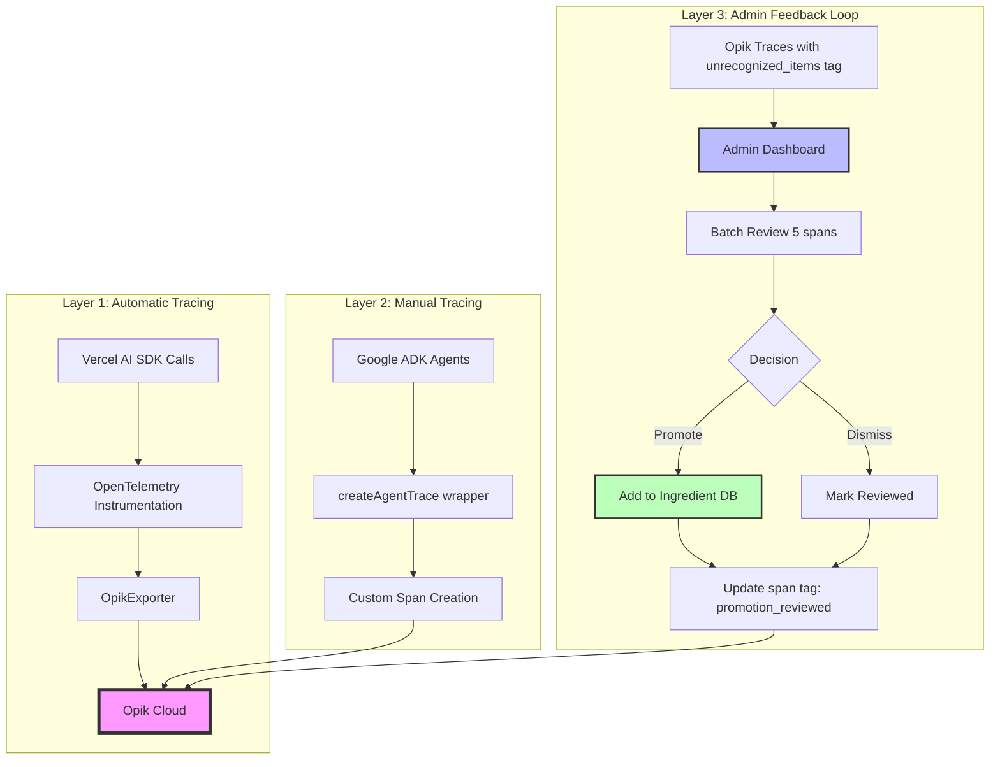
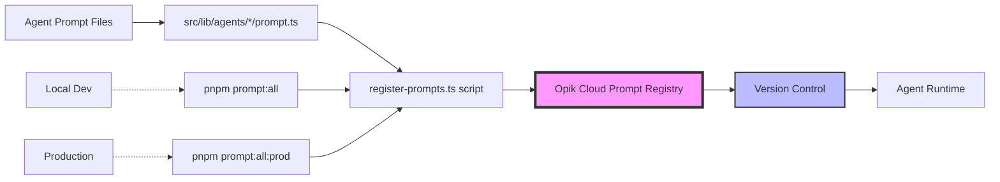
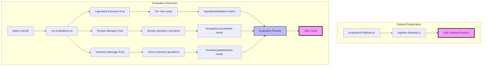
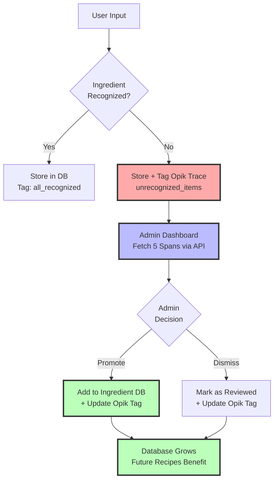

# Home Cuistot


**Built with ❤️ for the Encode AI x Comet Opik Commit To Change Hackathon**
> **Voice-first meal planning that starts with YOUR dishes**

[](https://www.youtube.com/watch?v=rltUKHn95mc)

It's 6 PM. You just got home from work and you're hungry. You open your fridge and stare. You have food and you know how to cook, but figuring out what to make with what you have is the part that kills you after a long day. So you close the fridge, grab your phone, and order takeout again.

**This isn't a cooking problem; it's a decision problem.** It happens to millions of busy professionals every single night.

Home Cuistot doesn't suggest recipes. It starts with your dishes—the 10 to 15 meals you already know how to make. You tell it what you cook and what you have in your kitchen, and it connects the two.

## Live Demo

**Production**: [homecuistot-commit-to-change.vercel.app](https://homecuistot-commit-to-change.vercel.app/)
**Admin Dashboard**: [/admin/unrecognized](https://homecuistot-commit-to-change.vercel.app/admin/unrecognized) (accessible to all, demo mode for jury)
**OAuth**: Google or Discord

---

## 💡 Why This Matters

**Solves the real problem**: Decision fatigue at 6 PM after work, not a lack of recipes
**Voice-first reduces friction**: Speak your ingredients when you're tired
**Starts with YOUR dishes**: Not generic recipe suggestions—meals you already know how to make
**Automatic inventory tracking**: "Mark as Cooked" keeps your pantry current

## 💻 How we built it?


We built a maintainable AI system in 3 weeks by focusing on:
1. **Iterative development**: Start simple, add complexity when measurements prove it's needed
2. **Data-driven decisions**: Opik provides the measurement layer for every improvement
3. **Production-ready foundations**: Full observability, evaluation pipelines, feedback loops from day one
4. **Honest limitations**: We know where we're still iterating and have clear paths forward

This isn't a perfect system. It's a foundation that can be improved incrementally with Opik as the measurement layer. That's what production AI looks like.

## 🤖 AI Agent Architecture

### Agent Details

| Agent | Tech Stack | Function Tools | Evaluation | Opik Pattern |
|-------|-----------|----------------|------------|--------------|
| **Voice Transcriptor** | Whisper-1 / Gemini Audio | N/A | Manual testing (future: audio datasets) | Manual span creation |
| **Ingredient Extractor** | Gemini 2.5 Flash Lite + Zod | N/A | 50+ test cases, F1 metrics (>95% target) | `opik-gemini` auto-tracing |
| **Recipe Manager** | Google ADK LlmAgent | create / update / delete / deleteAll | Custom dataset (mixed operations) | `createAgentTrace()` manual |
| **Inventory Manager** | Google ADK LlmAgent | updateMatching / updateAll | Voice operations dataset | `createAgentTrace()` manual |


---

## 🚀 Quick Links

- **⚠️ Login Required**: You need a Google or Discord account to access the app
- **Live Demo**: [homecuistot-commit-to-change.vercel.app](https://homecuistot-commit-to-change.vercel.app/)
- **Admin Dashboard**: [/admin/unrecognized](https://homecuistot-commit-to-change.vercel.app/admin/unrecognized) (accessible to all, demo mode for non-admin)
- **Timeline**: [TIMELINE.md](./TIMELINE.md) — 29 milestones across 3 weeks
- **Tech Docs**: [CLAUDE.md](./CLAUDE.md) — Commands and architecture

**Built for**: Encode AI x Comet Opik Commit To Change Hackathon
**Timeline**: 3 weeks (Jan 17 - Feb 8, 2026)
**Milestones**: +29 feature specifications
**Philosophy**: Iterative, data-driven AI development

---

## 🎯 Our Approach to AI Development

**We didn't try to build the perfect and most complex AI agent in 3 weeks.** Instead, we focused on steady, small iterations toward building agents that can be improved over time through data-driven measurements using Opik.

### Core Principles

1. **Start simple, add complexity only when data proves it's needed**
   We didn't build elaborate subagent delegation, complex guardrails, or multi-layer orchestration from day one. We built simple agents first, measured their performance with Opik, and added complexity only where measurements showed it was necessary.

2. **Keep the surface area of improvements manageable**
   It's better to have a simple, maintainable agent you can improve than a complex one you can't debug. Each agent has a clear responsibility and evaluation criteria.

3. **Let measurements guide architecture**
   Opik traces inform every decision: which agents need tools, where agents fall short, what prompts need refinement. We're not guessing—we're measuring.

### What We Did Right

- **Iterative development**: Simple Gemini calls → ADK agents with tools → evaluation pipelines
- **Data-driven decisions**: Opik traces inform agent improvements and database enrichment
- **Manageable scope**: Each agent has clear responsibility and evaluation criteria (ingredient recognition scores, recipe operations scores, etc...)
- **Production-ready observability**: Full tracing, custom evaluation task metrics, prompt versioning from day one
- **Feedback loop**: Metadata and tags attached to Opik spans allows inspecting Spans using Opik REST APIs and building a feedback loop mechanism that improves our system based on Opik production traces.

### Where We're Still Iterating (Honest Limitations)

We're not presenting a perfect system. Here's what we're actively improving:

#### 1. Dataset Refinement Needed
**Current**: Mixed creation/update/deletion operations in a single recipe-manager dataset
**Future**: Split into separate datasets (creation-only, update-only, deletion-only) for precise evaluation
**Reason**: Mixed scenarios add friction to performance analysis—we can't isolate which operation type is underperforming

#### 2. Audio Processing Pipeline Validation
**Current**: Manual testing only for voice input flows
**Planning**: Opik audio datasets to test "voice-transcriptor → inventory-manager" and "voice-transcriptor → recipe-manager" sequential architectures
**Why**: Need automated evaluation of end-to-end voice flows, not just text-based agent testing

#### 3. Custom Metric Performance
**Status**: Still tuning F1 thresholds and metric definitions
**Learning**: What "good enough" means for each agent type (precision vs recall trade-offs)
**Iterating**: Recipe ingredient extraction needs >95% F1, but inventory updates can tolerate lower precision if recall is high

### What We Learned About Opik Integration

#### The Good
- ✅ **Custom tracing worked smoothly** for ADK agents (no native OTel support)
- ✅ **opik-gemini automatic tracing** saved significant development time
- ✅ **Prompt versioning + dataset framework** enabled rapid iteration
- ✅ **Direct API integration** for span querying and tag management gave us full control

#### The Challenges (And How We Overcame Them)

##### 1. OpenAI Whisper Token Tracking
**Issue**: `opik-openai` doesn't capture Whisper response format for token counting
**Solution**: Manual span creation with token metadata extraction
**Result**: Full visibility into transcription costs

**Code**: [`apps/nextjs/src/lib/agents/voice-transcriptor/agent.ts:45-60`](apps/nextjs/src/lib/agents/voice-transcriptor/agent.ts)

##### 2. Google ADK-js Tracing
**Issue**: No native OpenTelemetry support in ADK-js (only python support). We could have rebuilt an opik integration via Google ADK callback system, but it was too tedious -> we decided to continue with custom traces, only tracing the tools we implemented.
**Solution**: Custom `createAgentTrace()` wrapper for sequential agent calls
**Result**: 1 trace per multi-agent flow with proper span hierarchy

**Code**: [`apps/nextjs/src/lib/tracing/opik-agent.ts`](apps/nextjs/src/lib/tracing/opik-agent.ts)

##### 3. Vercel AI SDK ThreadId Support
**Issue**: TypeScript types incomplete for `threadId` parameter
**Action**: Opened GitHub feature request [comet-ml/opik#4798](https://github.com/comet-ml/opik/issues/4798)
**Workaround**: Custom trace management until upstream fix, but in the end, we chose Google ADK.

##### 4. Span Search API Stale Data (The Big One)
**Issue**: After updating span tags, search API served stale results for a moment (at least locally).
**Debugging**: An Hour lost before discovering index lag
**Solution**: Fetch by span ID for authoritative state after tag updates
**Code**: [`getSpanById()` function in `opik-spans.ts`](apps/nextjs/src/lib/services/opik-spans.ts)

### Why This Matters

This approach keeps our agents:
- **Debuggable**: Simple architecture means clear error traces
- **Measurable**: Opik provides the data layer for improvement
- **Improvable**: Known limitations with clear paths to address them

We can build maintainable AI agents in 3 weeks. That matters more than architectural complexity.

---

## 🌟 Core Features

### 1. Voice-First Onboarding
Interactive 7-scene story ("Sam's Fridge") that demonstrates product value through narrative:
- Scenes 1-3: Problem introduction (decision paralysis)
- Scene 4: Voice input demo (eggs + parmesan)
- Scene 5: Recipe "READY" state
- Scene 6: "Mark as Cooked" workflow
- Scene 7: Manifesto + call-to-action

### 2. Inventory Management
- **4-level quantity scale**: 0=out, 1=low, 2=some, 3=plenty (reduces friction vs exact counts)
- **Pantry staples tracking**: Salt, pepper, olive oil never decrement
- **Voice + text input**: Speak or type ingredient updates
- **Category filtering**: 30 ingredient categories from OpenFoodFacts taxonomy
- **5,931 pre-loaded ingredients**: Faster matching, consistent categorization

### 3. Recipe Discovery
- **"What can I cook?"**: Calculates recipe availability based on current inventory
- **3 states**: Ready (cook now), Almost Ready (1-2 missing), Not Ready (3+ missing)
- **Automatic inventory decrement**: "Mark as Cooked" updates quantities
- **Cooking log**: Track your meal history

### 4. Admin Promotion Workflow (Continuous Improvement Loop)
- **Review unrecognized items** from Opik traces
- **Batch processing**: 5 spans at a time
- **Category assignment**: Promote items to ingredient database
- **Tag-based tracking**: `unrecognized_items` → `promotion_reviewed`
- **Real-time enrichment**: Database grows from 5,931 ingredients based on real user patterns

---

## 🔬 Opik Integration Showcase

This section demonstrates our production-ready usage of Opik across tracing, evaluation, prompt management, and continuous improvement workflows.

### 1. Three-Layer Observability Architecture

We built a comprehensive observability stack that captures every AI interaction at three levels:



**Layer 1 (Automatic)**: Zero-config tracing via `instrumentation.ts` with OpikExporter
**Layer 2 (Manual)**: Custom wrappers for ADK agents with span hierarchy
**Layer 3 (Feedback)**: Direct API integration for span querying and tag management

**Implementation**: [`apps/nextjs/src/instrumentation.ts`](apps/nextjs/src/instrumentation.ts) | [`apps/nextjs/src/lib/tracing/opik-agent.ts`](apps/nextjs/src/lib/tracing/opik-agent.ts) | [`apps/nextjs/src/lib/services/opik-spans.ts`](apps/nextjs/src/lib/services/opik-spans.ts)

---

### 2. Prompt Management Pipeline

We manage 4 versioned prompts across our agent architecture with automated registration:



**Prompt Discovery**: Script recursively finds `prompt.ts` files
**Metadata Extraction**: Each prompt includes name, description, tags, environment
**Idempotent Registration**: Safe to re-run, updates existing prompts
**Environment Separation**: Local vs production prompt namespaces

**4 Managed Prompts**:
- Voice Transcriptor (English extraction from multilingual audio)
- Ingredient Extractor (Add/remove operations with auto-translation)
- Recipe Manager (CRUD with create/update/delete/delete_all tools)
- Inventory Manager (Voice-controlled pantry with bulk operations)

**Implementation**: [`apps/nextjs/scripts/register-prompts.ts`](apps/nextjs/scripts/register-prompts.ts)

---

### 3. Evaluation Framework

We built a comprehensive evaluation system with custom metrics and dataset-driven testing:



#### Custom Evaluation Metrics

**IngredientSetMatch** (7 scores per evaluation):
- **Add Precision**: % of extracted "add" ingredients that are correct
- **Add Recall**: % of actual "add" ingredients successfully extracted
- **Add F1**: Harmonic mean of add precision and recall
- **Remove Precision**: % of extracted "remove" ingredients that are correct
- **Remove Recall**: % of actual "remove" ingredients successfully extracted
- **Remove F1**: Harmonic mean of remove precision and recall
- **Overall F1**: Average of add F1 and remove F1 (target: >95%)

**Example Calculation**:
```
Input: "Add eggs and butter, remove old milk"
Expected: { add: ["eggs", "butter"], rm: ["milk"] }
Agent Output: { add: ["egg", "butter"], rm: [] }

Add Precision: 1.0 (2 correct / 2 total)
Add Recall: 1.0 (2 correct / 2 expected)  [Note: "egg" matches "eggs" via normalization]
Add F1: 1.0

Remove Precision: 1.0 (0 false positives / 0 total)
Remove Recall: 0.0 (0 correct / 1 expected)
Remove F1: 0.0

Overall F1: 0.5 (average of 1.0 and 0.0)
```

**Implementation**: [`apps/nextjs/evaluation/ingredient-extractor/metrics/IngredientSetMatch.ts`](apps/nextjs/evaluation/ingredient-extractor/metrics/IngredientSetMatch.ts)

**RecipeOperationMatch** (10 scores per evaluation):
- **Operation Precision**: % of extracted operations that are correct (create/update/delete)
- **Operation Recall**: % of actual operations successfully extracted
- **Operation F1**: Harmonic mean of operation precision and recall
- **Title Precision**: % of recipe titles matched using Levenshtein distance (70% threshold)
- **Title Recall**: % of expected recipe titles successfully matched
- **Title F1**: Harmonic mean of title precision and recall
- **Title Similarity**: Average `Levenshtein` similarity ratio for matched titles
- **Overall F1**: Average of operation F1 and title F1
- **No Changes Match**: Binary score (1.0 if noChangesDetected flags match)
- **Structure Match**: Binary validation of proposal structure (recipes array + fields)

**Implementation**: [`apps/nextjs/evaluation/recipe-manager/metrics/RecipeOperationMatch.ts`](apps/nextjs/evaluation/recipe-manager/metrics/RecipeOperationMatch.ts)

**InventoryUpdateMatch** (11 scores per evaluation):
- **Ingredient Precision**: % of extracted ingredients that are correct
- **Ingredient Recall**: % of actual ingredients successfully extracted
- **Ingredient F1**: Harmonic mean of ingredient precision and recall
- **Quantity Precision**: % of quantity levels (0-3) correctly assigned
- **Quantity Recall**: % of expected quantity levels successfully assigned
- **Quantity F1**: Harmonic mean of quantity precision and recall
- **Staple Precision**: % of pantry staple flags correctly assigned
- **Staple Recall**: % of expected pantry staple flags successfully assigned
- **Staple F1**: Harmonic mean of staple precision and recall
- **Overall F1**: Average of ingredient F1, quantity F1, and staple F1
- **Unrecognized Count Match**: Binary score (1.0 if unrecognized counts match)

**Implementation**: [`apps/nextjs/evaluation/inventory-manager/metrics/InventoryUpdateMatch.ts`](apps/nextjs/evaluation/inventory-manager/metrics/InventoryUpdateMatch.ts)

#### Evaluation Datasets

**Ingredient Extractor (50+ test cases)**:
- Multilingual input (English, French, Spanish, German)
- Edge cases: profanity, vague inputs, compound ingredients
- Batch operations: "refill everything", "delete all non-staples"

**Recipe Manager**:
- Recipe creation scenarios
- Ingredient updates (add/remove/toggle optional)
- Batch delete operations

**Inventory Manager**:
- Voice-controlled refill/delete/update quantity
- Bulk operations with filtering
- Pantry staple handling

**Commands**:
```bash
pnpm dataset:register  # Register all datasets to Opik
pnpm eval              # Run single evaluation (e.g., pnpm eval ingredient-extractor 10)
pnpm eval:all          # Run all evaluations
```

**Implementation**: [`apps/nextjs/scripts/register-datasets.ts`](apps/nextjs/scripts/register-datasets.ts) | [`apps/nextjs/scripts/run-evaluations.ts`](apps/nextjs/scripts/run-evaluations.ts)

---

### 4. Continuous Improvement Loop (The Crown Jewel)

This is where Opik becomes the measurement layer for continuous system improvement. Here's how we turn real user interactions into database enrichment:



#### Technical Deep-Dive

**Step 1: Tag Traces During Agent Execution**

When the Recipe Manager agent encounters unrecognized ingredients, we tag the Opik trace:

```typescript
// During agent orchestration
const unrecognizedItems = proposal.items.filter(item => !item.recognized);
const tags = unrecognizedItems.length > 0
  ? ['unrecognized_items', `user:${userId}`]
  : ['all_recognized', `user:${userId}`];

traceCtx.trace.update({
  metadata: { unrecognizedItems },
  tags
});
```

**Step 2: Query Spans via Direct Opik API**

Admin dashboard fetches unprocessed spans using tag-based search:

```typescript
// apps/nextjs/src/lib/services/opik-spans.ts
export async function getNextUnprocessedSpans(limit = 5) {
  // Search for spans tagged "unrecognized_items"
  const searchResults = await fetch(`${OPIK_URL}/spans/search`, {
    method: 'POST',
    body: JSON.stringify({
      filters: [{ field: 'tags', operator: 'contains', value: 'unrecognized_items' }],
      limit
    })
  });

  // IMPORTANT: Fetch by ID to bypass stale search index
  const spans = await Promise.all(
    searchResults.map(span => getSpanById(span.id))
  );

  return spans;
}
```

**Why `getSpanById()`?** Span search API serves stale data after tag updates (~10+ seconds lag). Fetching by ID guarantees authoritative state.

**Step 3: Batch Review Interface**

Admin reviews 5 spans at a time, assigns categories, promotes or dismisses:

```typescript
// apps/nextjs/src/app/(admin)/admin/unrecognized/page.tsx
const handlePromoteSpan = async (span) => {
  // Promote selected items to ingredient database
  await fetch('/api/admin/ingredients/promote', {
    method: 'POST',
    body: JSON.stringify({
      spanId: span.spanId,
      promotions: [
        { name: 'greek yogurt', category: 'dairy' },
        { name: 'sriracha', category: 'condiments' }
      ]
    })
  });
};
```

**Step 4: Update Opik Tags**

After promotion, we swap the span tag to mark it as reviewed:

```typescript
// apps/nextjs/src/lib/services/opik-spans.ts
export async function markSpanAsReviewed(spanId: string) {
  const span = await getSpanById(spanId);

  // Remove "unrecognized_items", add "promotion_reviewed"
  const updatedTags = span.tags
    .filter(tag => tag !== 'unrecognized_items')
    .concat('promotion_reviewed');

  await fetch(`${OPIK_URL}/spans/${spanId}`, {
    method: 'PATCH',
    body: JSON.stringify({ tags: updatedTags })
  });
}
```

**Step 5: Database Grows, Future Recipes Benefit**

Once promoted, ingredients are recognized automatically in future agent calls. The database grows from 5,931 → continuously enriched based on real user patterns.

**Implementation**: [`apps/nextjs/src/app/(admin)/admin/unrecognized/page.tsx`](apps/nextjs/src/app/(admin)/admin/unrecognized/page.tsx) | [`apps/nextjs/src/lib/services/opik-spans.ts`](apps/nextjs/src/lib/services/opik-spans.ts)

## 📅 Development Timeline

Refer to the [Timeline](TIMELINE.md) document.

## Opik Workflows

```bash
# Register prompts to Opik (local)
cd apps/nextjs
pnpm prompt:all

# Register prompts to Opik (production)
pnpm prompt:all:prod

# Register evaluation datasets
pnpm dataset:register

# Run single evaluation
pnpm eval ingredient-extractor 10

# Run all evaluations
pnpm eval:all
```

### Database Commands

```bash
# Generate migration from schema changes
pnpm db:generate

# Apply migrations to local DB
pnpm db:migrate

# Check migration status
pnpm db:status

# Open Drizzle Studio GUI
pnpm db:studio
```
