# Home Cuistot


**Built by me (and Claude Code😶‍🌫️) with ❤️ for the Encode AI x Comet Opik Commit To Change Hackathon**

> **HomeCuistot lets you manage your kitchen by voice. Say what you have, say what you cook — see what's ready to cook instantly.**

## Youtube Pitching video

[](https://www.youtube.com/watch?v=rltUKHn95mc)

It's 6 PM. You just got home from work and you're hungry. You open your fridge and stare. You have food and you know how to cook, but figuring out what to make with what you have is the part that kills you after a long day. So you close the fridge, grab your phone, and order takeout again.

**This isn't a cooking problem; it's a decision problem.** It happens to millions of busy professionals every single night.

Home Cuistot doesn't suggest recipes. It starts with your dishes—the 10 to 15 meals you already know how to make. You tell it what you cook and what you have in your kitchen, and it connects the two.

**External Links**:
- [Live Demo](https://homecuistot-commit-to-change.vercel.app/)
- [Admin Dashboard](https://homecuistot-commit-to-change.vercel.app/admin/unrecognized)
- [Demo Video](https://www.youtube.com/watch?v=rltUKHn95mc)


## 💡 Why This Matters

**Solves the real problem**: Decision fatigue at 6 PM after work, not a lack of recipes

**Voice-first reduces friction**: Describe your ingredients when you're tired, no pictures to take, no receipts to keep

**Starts with YOUR dishes**: Instead of generic recipe suggestions that add decision fatigue, HomeCuistot focuses on the meals you already know how to make.

**Automatic inventory tracking**: "Mark as Cooked" keeps your inventory up to date, no need to look for the exact quantities to log into the app


## Specific OPIK documentation


- [docs/OPIK_INTEGRATION.md](./docs/OPIK_INTEGRATION.md) - Full Opik integration documentation into HomeCuistot

## 💻 How we built it?


We built a maintainable AI system in 3 weeks by focusing on:
1. **Iterative development**: Start simple, no over-engineered AI Agents from the start
2. **Data-driven decisions**: Opik provides the measurement layer for every improvement
3. **Production-ready foundations**: Full observability, evaluation pipelines, feedback loops from day one
4. **Honest limitations**: We know where we're still iterating and have clear paths forward

We built a foundation that can be improved incrementally with Opik as the measurement layer. It's not just another vibe-coded app.


## 🚀 Quick Start

**Live Demo**: [homecuistot-commit-to-change.vercel.app](https://homecuistot-commit-to-change.vercel.app/)

**Admin Dashboard**: [/admin/unrecognized](https://homecuistot-commit-to-change.vercel.app/admin/unrecognized) (accessible to all, demo mode for jury)

**OAuth**: Sign in with Google or Discord

**Run Locally (Opik/Supabase/Oauth) - Docker required**:
```bash
# Clone repository
git clone https://github.com/your-repo/homecuistot-commit-to-change.git
cd homecuistot-commit-to-change/apps/nextjs

# Install dependencies
pnpm install

# Setup environment variables
# Note: OAuth credentials required for authentication (Google and Discord providers)
# Setup guides: Google (https://supabase.com/docs/guides/auth/social-login/auth-google?queryGroups=framework&framework=nextjs)
#               Discord (https://supabase.com/docs/guides/auth/social-login/auth-discord?queryGroups=framework&framework=nextjs)
cp .env.local.example .env.local

# Start development server and Opik/Supabase
make dev-all

# Apply db migrations from the apps/nextjs folder
pnpm db:migrate
```

**Documentation**:
- **Setup & Commands**: [CLAUDE.md](./CLAUDE.md)
- **Development Timeline**: [TIMELINE.md](./TIMELINE.md)
- **Development Philosophy**: [docs/DEVELOPMENT_APPROACH.md](./docs/DEVELOPMENT_APPROACH.md)
- **Opik Integration**: [docs/OPIK_INTEGRATION.md](./docs/OPIK_INTEGRATION.md)

## 🏗️ Architecture Overview

```mermaid
graph LR
    User[👤 User]
    Next[Next.js App<br/>React 19]
    DB[(Supabase<br/>PostgreSQL)]
    Redis[Upstash<br/>Rate Limiter]
    LLM[LLM Providers<br/>Gemini + Whisper]
    Opik[Opik<br/>Tracing]

    User --> Next
    Next --> DB
    Next --> Redis
    Next --> LLM
    LLM -.-> Opik
    Next -.-> Opik

    style User fill:#e1f5ff
    style Next fill:#e8f5e9
    style DB fill:#e8f5e9
    style Redis fill:#fce4ec
    style LLM fill:#f3e5f5
    style Opik fill:#fff4e1
```



**Stack**: Next.js 16 → Supabase (RLS) + Upstash (rate limit) + Gemini/Whisper → Opik (observability)

## 🤖 AI Agent Architecture

### Agent Details

| Agent | Tech Stack | Function Tools | Evaluation | Opik Pattern |
|-------|-----------|----------------|------------|--------------|
| **Voice Transcriptor** | Whisper-1 / Gemini Audio | N/A | Manual testing (future: audio datasets) | Manual span creation |
| **Ingredient Extractor** | Gemini 2.5 Flash Lite + Zod | N/A | 50+ test cases, F1 metrics (>95% target) | `opik-gemini` auto-tracing |
| **Recipe Manager** | Google ADK LlmAgent | create / update / delete / deleteAll | Custom dataset (mixed operations) | `createAgentTrace()` manual |
| **Inventory Manager** | Google ADK LlmAgent | updateMatching / updateAll | Voice operations dataset | `createAgentTrace()` manual |

**Note on ADK Usage**: Google ADK is used for agents requiring function tools (Recipe Manager, Inventory Manager) due to its multi-turn conversation design and compositional architecture. This decision enables future development of an orchestrator agent that can coordinate these subagents more easily. The current implementation enforces single-turn execution where agents terminate immediately after tool calls. Future versions will support multi-turn orchestration and subagent invocation (Inventory and Recipe Managers) through a chatbot interface on the homepage.

---

## 🎯 Development Philosophy

We focused on:
- **Start simple, add complexity when data proves it's needed**
- **Keep the improvement surface area manageable**
- **Let measurements guide architecture**

### What We Did Right
✅ Iterative development (simple Gemini calls → ADK agents with tools → evaluation pipelines)
✅ Data-driven decisions (Opik traces inform agent improvements)
✅ Manageable scope (each agent has clear responsibility)
✅ Production-ready observability (full tracing from day one)
✅ Feedback loop (metadata and tags enable continuous improvement)

### Where We're Still Iterating (Honest Limitations)
- Dataset refinement needed (split mixed operations into separate datasets)
- Audio processing pipeline validation requires dedicated Opik audio datasets
- Custom metric performance (tuning F1 thresholds)

**[→ Read full development approach](docs/DEVELOPMENT_APPROACH.md)**

### 🚀 Future Iterations

**Multi-Turn Orchestration Agent**: We plan to build a homepage chat interface that coordinates the Recipe Manager and Inventory Manager subagents through natural multi-turn conversations, enabling users to discover recipes, update inventory, and plan meals in a single dialogue flow.

**Enhanced Ingredient Recognition**: An alias system will improve ingredient matching by recognizing variations like "frozen peas" as "peas" or "EVOO" as "extra virgin olive oil", reducing false negatives caused by different naming conventions.

**Unrecognized Items Report**: Users will be able to view a dashboard of items that weren't matched to the ingredient database, allowing them to track gaps and request additions to the catalog (database tables are already implemented).

**End-to-End Audio Evaluation**: We will create audio-based datasets to test the complete voice pipeline from Whisper transcription through agent logic, validating the full voice-to-action workflow rather than just text-based unit tests.

**Edge Device Inference with Gemma 3N**: A fallback to the on-device Gemma 3N model (mentioned in the Gemini workshop) will enable offline capability for basic operations and reduce API costs for high-frequency interactions.

**Additional Improvements**: We plan to split mixed operation datasets by intent, tune F1 thresholds based on production trace analysis, and expand admin tooling for ingredient catalog management.

---

## 🌟 Core Features

### 1. Voice-First Onboarding
Interactive 7-scene story ("Sam's Fridge") that demonstrates product value through narrative:

### 2. Inventory Management
- **4-level quantity scale**: 0=out, 1=low, 2=some, 3=plenty (reduces friction vs exact counts)
- **Pantry staples tracking**: Salt, pepper, olive oil never decrement
- **Voice + text input**: Speak or type ingredient updates
- **Category filtering**: 30 ingredient categories from OpenFoodFacts taxonomy
- **5,931 pre-loaded ingredients**: Faster matching, consistent categorization

### 3. Recipe Discovery
- **"What can I cook?"**: Calculates recipe availability based on current inventory
- **3 states**: Ready (cook now), Almost Ready (1-2 missing), Not Ready (3+ missing)
- **Automatic inventory decrement**: "Mark as Cooked" updates quantities
- **Cooking log**: Track your meal history

### 4. Admin Promotion Workflow (Continuous Improvement Loop)
- **Review unrecognized items** from Opik traces
- **Batch processing**: 5 spans at a time
- **Category assignment**: Promote items to ingredient database
- **Tag-based tracking**: `unrecognized_items` → `promotion_reviewed`
- **Real-time enrichment**: Database grows from 5,931 ingredients based on real user patterns

---

## 🔬 Opik Integration Highlights

We built production-ready observability across three layers:

### Three-Layer Tracing Architecture
1. **Automatic Tracing**: Vercel AI SDK → OpenTelemetry → OpikExporter
2. **Manual Tracing**: Google ADK agents → Custom `createAgentTrace()` wrapper
3. **Feedback Loop**: Admin dashboard → Opik API → Span tag updates

### Prompt Management
- 4 versioned prompts (Voice Transcriptor, Ingredient Extractor, Recipe Manager, Inventory Manager)
- Automated registration via `pnpm prompt:all` (local) or `pnpm prompt:all:prod` (production)
- Environment separation (local/production namespaces)

### Evaluation Framework
- **Custom metrics**: IngredientSetMatch (7 scores), RecipeOperationMatch (10 scores), InventoryUpdateMatch (11 scores)
- **F1 scoring**: Precision/recall analysis for each agent
- **Dataset-driven**: 50+ test cases for ingredient extraction, recipe operations, inventory management
- **Commands**: `pnpm eval` (single), `pnpm eval:all` (all evaluations)

### Continuous Improvement Loop
Real user inputs → Opik traces → Admin review → Database enrichment → Future recipes benefit

### Annotation Queues for Prompt Refinement
Filter traces by `user:id` tag → Review test sessions → Annotate edge cases → Refine prompts based on patterns

**The system grows smarter from real usage patterns.**

**[→ Full Opik integration guide with code examples](docs/OPIK_INTEGRATION.md)**

## 📅 Development Timeline

**3 weeks, 29 milestones, 400+ commits**

- **Week 1 (Jan 17-24)**: Infrastructure & voice onboarding
- **Week 2 (Jan 24-31)**: Core features & recipe management
- **Week 3 (Feb 1-6)**: Advanced features & production polish

**[→ View detailed timeline](TIMELINE.md)**

---

## 🔗 Additional Resources

**Project Documentation**:
- [CLAUDE.md](./CLAUDE.md) - Setup guide, commands, architecture reference
- [TIMELINE.md](./TIMELINE.md) - 29 milestones across 3 weeks
- [docs/DEVELOPMENT_APPROACH.md](./docs/DEVELOPMENT_APPROACH.md) - Philosophy and lessons learned
- [docs/OPIK_INTEGRATION.md](./docs/OPIK_INTEGRATION.md) - Full Opik integration guide

**Technical Docs**:
- [Database Layer](./apps/nextjs/src/db/README.md) - Drizzle ORM patterns, RLS usage, query examples
- [Recipe Manager Agent](./apps/nextjs/src/lib/agents/recipe-manager/README.md) - ADK agent architecture
- [Inventory Manager Agent](./apps/nextjs/src/lib/agents/inventory-manager/README.md) - Voice-controlled pantry

---

## 📊 Key Metrics

| Metric | Value |
|--------|-------|
| **Development Period** | 20 days (Jan 17 - Feb 8, 2026) |
| **Total Milestones** | 29 feature specifications |
| **Git Commits** | 400+ commits |
| **Database Ingredients** | 5,931 across 30 categories |
| **AI Models** | Gemini 2.0/2.5 Flash Lite, OpenAI Whisper-1 |
| **Evaluation Dataset** | 200+ test cases |
| **Tech Stack** | Next.js 16, React 19, Supabase, Opik, Drizzle ORM |
| **Architecture** | Server Components, Server Actions, Row Level Security |

---

**Built for**: Encode AI x Comet Opik Commit To Change Hackathon

**Timeline**: 3 weeks (Jan 17 - Feb 8, 2026)

**Philosophy**: Iterative, data-driven AI development
