# AI Agent Architecture

## Core Concept

> The AI does one thing: it understands natural voice input and turns it into structured kitchen data.

```mermaid
graph LR
    USER["🎤 Voice Input<br/><i>'I bought chicken, tomatoes,<br/>and I can make a carbonara'</i>"]

    AI["🤖 AI Agent"]

    subgraph output [" Structured Kitchen Data "]
        direction TB
        INV["🥬 Inventory<br/><i>chicken · qty 3 · staple ✗<br/>tomato · qty 3 · staple ✗</i>"]
        REC["🍳 Recipe<br/><i>Carbonara<br/>bacon · egg · parmesan</i>"]
    end

    USER -->|speech to text| AI
    AI -->|ingredients| INV
    AI -->|recipes| REC

    style USER fill:#fef3c7,stroke:#d97706
    style AI fill:#dbeafe,stroke:#2563eb
    style output fill:#d1fae5,stroke:#059669
```

---

## System Overview

---

## Inventory Orchestrator

Coordinates voice transcription and inventory updates from natural language.

---

## Recipe Orchestrator

Coordinates voice transcription and recipe CRUD from natural language.

---

## Voice Transcriptor

Dual-provider voice-to-text with multilingual support.

```mermaid
graph TB
    AUDIO["Audio input<br/><i>base64</i>"]

    subgraph Providers
        WHISPER["OpenAI Whisper<br/><i>whisper-1</i>"]
        GEMINI["Google Gemini<br/><i>2.5 Flash Lite</i>"]
    end

    AUDIO --> WHISPER
    AUDIO --> GEMINI

    TEXT["Transcribed text<br/><i>English · food names preserved</i>"]
    WHISPER --> TEXT
    GEMINI --> TEXT

    style Providers fill:#fef3c7,stroke:#d97706
```

---

## Inventory Agent — Tools

```mermaid
graph TB
    AGENT["Inventory Agent<br/><i>ADK LlmAgent · tool-only</i>"]

    MATCH["update_matching_ingredients<br/><i>name → DB match · qty 0-3 · staple flag</i>"]
    BULK["update_all_tracked_ingredients<br/><i>bulk qty/staple update on all items</i>"]

    AGENT --> MATCH
    AGENT --> BULK

    DB[("ingredients table<br/>5931 rows")]
    MATCH --> DB
    BULK --> DB

    style AGENT fill:#d1fae5,stroke:#059669
    style DB fill:#f3e8ff,stroke:#7c3aed
```

---

## Recipe Manager Agent — Tools

```mermaid
graph TB
    AGENT["Recipe Manager Agent<br/><i>ADK LlmAgent · tool-only</i>"]

    CREATE["create_recipes<br/><i>1-5 recipes · 1-10 ingredients each</i>"]
    UPDATE["update_recipes<br/><i>title · description · add/remove ingredients</i>"]
    DELETE["delete_recipes<br/><i>1-10 recipe IDs</i>"]
    DELETE_ALL["delete_all_recipes"]

    AGENT --> CREATE
    AGENT --> UPDATE
    AGENT --> DELETE
    AGENT --> DELETE_ALL

    DB[("ingredients table")]
    CREATE -->|validate names| DB

    style AGENT fill:#d1fae5,stroke:#059669
    style DB fill:#f3e8ff,stroke:#7c3aed
```

---

## Data Flow Example — Voice Inventory Update

```mermaid
sequenceDiagram
    participant U as User
    participant API as /api/inventory/agent-proposal
    participant O as Inventory Orchestrator
    participant V as Voice Transcriptor
    participant A as Inventory Agent
    participant T as update_matching_ingredients
    participant DB as Database

    U->>API: audio (base64)
    API->>O: createInventoryManagerAgentProposal()
    O->>V: transcribe audio
    V-->>O: "I bought chicken and tomatoes"
    O->>A: run agent with text
    A->>T: tool call
    T->>DB: matchIngredients()
    DB-->>T: chicken ✓, tomato ✓
    T-->>A: recognized + unrecognized
    A-->>O: proposal
    O-->>API: InventoryUpdateProposal
    API-->>U: JSON response
```

