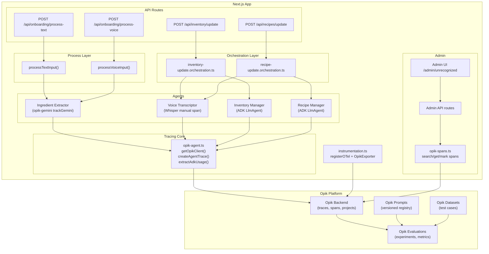
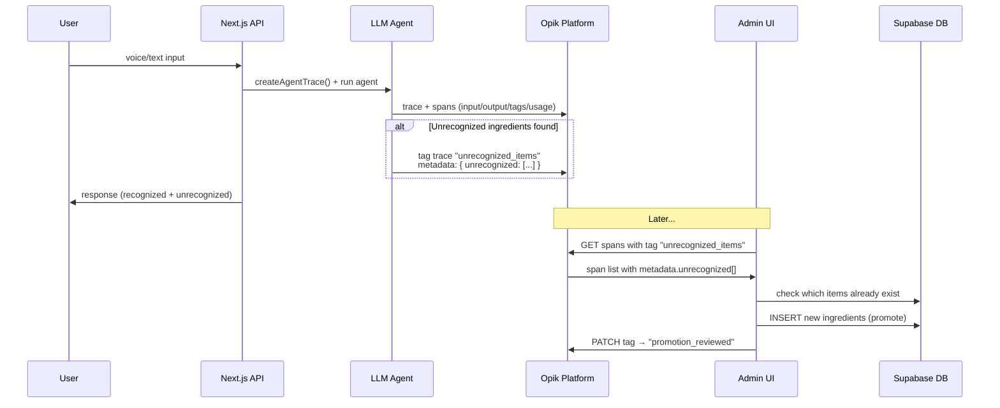
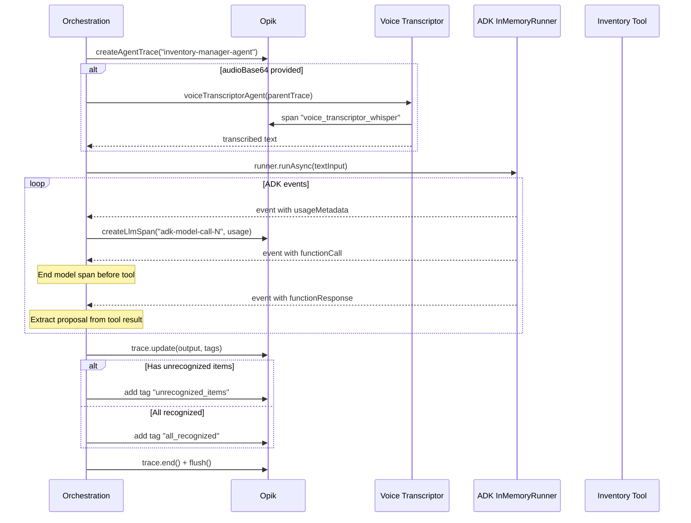
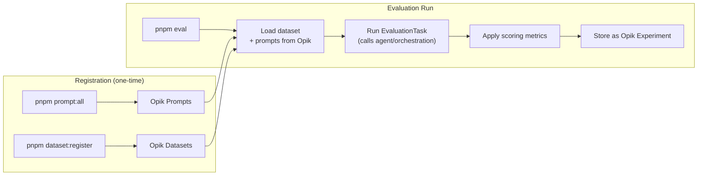
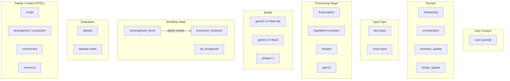

# Opik LLM Observability — Technical Documentation

## Table of Contents

1. [Dependencies & Configuration](#1-dependencies--configuration)
2. [Architecture Overview](#2-architecture-overview)
3. [Instrumentation Bootstrap](#3-instrumentation-bootstrap)
4. [Tracing Utilities](#4-tracing-utilities)
5. [Agent Tracing](#5-agent-tracing)
6. [Orchestration Layer Tracing](#6-orchestration-layer-tracing)
7. [Onboarding Entry Points](#7-onboarding-entry-points)
8. [Prompt Management](#8-prompt-management)
9. [Dataset Management](#9-dataset-management)
10. [Evaluation Framework](#10-evaluation-framework)
11. [Custom Metrics](#11-custom-metrics)
12. [Admin Span API & Human-in-the-Loop](#12-admin-span-api--human-in-the-loop)
13. [Tag Taxonomy](#13-tag-taxonomy)
14. [CLI Scripts](#14-cli-scripts)
15. [Infrastructure](#15-infrastructure)
16. [File Index](#16-file-index)

---

## 1. Dependencies & Configuration

### NPM packages

| Package | Version | Role |
|---------|---------|------|
| `opik` | ^1.9.89 | Core SDK — client, traces, spans, prompts, datasets, evaluate() |
| `opik-gemini` | ^1.9.98 | `trackGemini()` wrapper — auto-traces Google GenAI calls |
| `opik-openai` | ^1.10.2 | OpenAI integration (installed, Whisper traced manually) |
| `opik-vercel` | ^1.9.89 | `OpikExporter` for Vercel OTEL pipeline |
| `@vercel/otel` | ^2.1.0 | OpenTelemetry registration for Next.js |

### next.config.ts

Opik packages listed as `serverExternalPackages` to prevent Next.js bundler issues:

```ts
serverExternalPackages: ["opik", "opik-vercel", "@opentelemetry/api-logs", "@opentelemetry/sdk-logs"]
```

### Environment variables

| Variable | Default | Description |
|----------|---------|-------------|
| `OPIK_URL_OVERRIDE` | `http://localhost:5173/api` | Opik backend URL (local or cloud) |
| `OPIK_PROJECT_NAME` | `homecuistot-hackathon` | Project namespace for all traces |
| `OPIK_API_KEY` | — | Cloud auth (no "Bearer " prefix) |
| `OPIK_WORKSPACE` | — | Cloud workspace (sent as `Comet-Workspace` header) |

---

## 2. Architecture Overview



### Data flow: production trace to data enrichment



---

## 3. Instrumentation Bootstrap

**File:** `src/instrumentation.ts` (14 lines)

```ts
import { registerOTel } from "@vercel/otel";
import { OpikExporter } from "opik-vercel";

export function register() {
  const env = process.env.VERCEL_ENV || "development";
  const commitSha = process.env.VERCEL_GIT_COMMIT_SHA || "";
  const vercelUrl = process.env.VERCEL_URL || "";
  registerOTel({
    serviceName: "homecuistot-hackathon",
    traceExporter: new OpikExporter({
      tags: ["nextjs", env, commitSha, vercelUrl].filter(Boolean),
    }),
  });
}
```

**What happens:** Next.js calls `register()` at startup. Every Vercel AI SDK call (`ai` package) automatically emits OTEL spans → `OpikExporter` forwards them to Opik. Tags include deploy environment, git SHA, and Vercel URL for trace attribution.

---

## 4. Tracing Utilities

**File:** `src/lib/tracing/opik-agent.ts` (102 lines)

### Singleton client

```ts
let opikClient: Opik | null = null;

export function getOpikClient(): Opik {
  if (!opikClient) {
    opikClient = new Opik({
      projectName: process.env.OPIK_PROJECT_NAME ?? "homecuistot",
    });
  }
  return opikClient;
}
```

Module-level singleton prevents creating multiple Opik clients across requests.

### createAgentTrace()

Creates a parent trace and returns an `AgentTraceContext` with helpers:

```ts
interface AgentTraceContext {
  client: Opik;
  trace: Trace;
  createLlmSpan(params: LlmSpanParams): Span;   // type: "llm", provider: "google_ai"
  // createToolSpan(params): Span;                // commented out — not yet active
  end(): void;
  flush(): Promise<void>;
}
```

**Parameters accepted:**

| Field | Type | Description |
|-------|------|-------------|
| `name` | string | Trace name (e.g., "inventory-manager-agent") |
| `input` | Record | Captured input payload |
| `output` | Record | Set after execution via `trace.update()` |
| `metadata` | Record | Context data (userId, model, currentInventory) |
| `tags` | string[] | Filterable tags |
| `threadId` | string? | Optional thread grouping |

### extractAdkUsage()

Converts Google ADK token format to Opik format:

```
ADK: { promptTokenCount, candidatesTokenCount, totalTokenCount }
  → Opik: { prompt_tokens, completion_tokens, total_tokens }
```

---

## 5. Agent Tracing

Four agents, each traced differently:

### 5.1 Ingredient Extractor (`src/lib/agents/ingredient-extractor/agent.ts`)

**Tracing method:** `opik-gemini` `trackGemini()` wrapper

```ts
const trackedGenAI = trackGemini(genAI, {
  parent: parentTrace,           // links to parent trace
  client,                        // shares singleton Opik client
  generationName: "ingredient_extractor",
  traceMetadata: {
    tags: [...userTag, "ingredient-extraction", "voice-input" | "text-input"],
  },
});
```

**Whisper transcription:** When `voiceProvider === "openai"`, a manual span is created:

```ts
parentTrace.span({
  name: "voice_transcriptor_whisper",
  input: { mimeType, audioSizeBytes },
  output: { text: inputText },
  type: "llm",
  model: "whisper-1",
  provider: "openai",
  tags: [...userTag, "transcription", "voice-input", "whisper"],
  startTime, endTime,
});
```

### 5.2 Voice Transcriptor (`src/lib/agents/voice-transcriptor/agent.ts`)

**Two providers:**

| Provider | Tracing method |
|----------|---------------|
| Google Gemini | `trackGemini()` with `parent: parentTrace` |
| OpenAI Whisper | Manual `parentTrace.span()` (opik-openai doesn't parse Whisper response format) |

Both providers: `await client.flush()` or `await trackedGenAI.flush()` after call.

### 5.3 Inventory Manager (`src/lib/agents/inventory-manager/agent.ts`)

**Tracing method:** Receives `opikTrace: Trace` param → passed to tools.

```ts
export function createInventoryAgent(params: CreateInventoryAgentParams) {
  const { userId, model, opikTrace } = params;
  return new LlmAgent({
    name: PROMPT.name,
    tools: [
      createUpdateMatchingIngredientsTool({ userId, opikTrace }),
      createUpdateAllTrackedIngredientsTool({ userId, opikTrace }),
    ],
  });
}
```

ADK has no native Opik integration. Trace passed manually through tool constructors.

### 5.4 Recipe Manager (`src/lib/agents/recipe-manager/agent.ts`)

Same pattern as Inventory Manager. Tools receive `opikTrace` and create tool-type spans:

```ts
// Inside create-recipes.ts tool execute():
const span = opikTrace.span({
  name: "create_recipes",
  type: "tool",
  input,
  tags: [`user:${userId}`],
});
// ... tool logic ...
span.update({ output: result, metadata, tags });
span.end();
```

**Tools with Opik spans:** `create_recipes`, `update_recipes`, `delete_recipes`, `delete_all_recipes`

---

## 6. Orchestration Layer Tracing

### 6.1 Inventory Update Orchestration

**File:** `src/lib/orchestration/inventory-update.orchestration.ts` (230 lines)



**Key details:**
- Parent trace tags: `["orchestration", "inventory_update", inputType, model, "user:{userId}"]`
- Metadata includes full `currentInventory` array
- Each ADK model call gets its own LLM span with token usage
- Model span is ended before tool span starts (correct Opik UI ordering)
- Token usage aggregated across all model calls into response
- Error path: trace output set to `{ error: String(error) }`, then end + flush

### 6.2 Recipe Update Orchestration

**File:** `src/lib/orchestration/recipe-update.orchestration.ts` (275 lines)

Same pattern as inventory. Additional features:
- Injects tracked recipes + ingredients as YAML into ADK conversation history
- Supports `isOnBoarding` flag → adds "onboarding" tag
- Collects unrecognized items from recipe results (create/update operations)
- Captures `assistantResponse` from model text parts

---

## 7. Onboarding Entry Points

Two process files create the initial parent trace for onboarding flows:

### processTextInput (`src/lib/prompts/onboarding-text/process.ts`)

```ts
const traceCtx = createAgentTrace({
  name: "onboarding-text-input",
  input: { text, currentIngredients },
  tags: [...userTag, "onboarding", "text-input", "ingredient-extraction"],
  metadata: { inputType: "text", domain: "onboarding" },
});

const result = await ingredientExtractorAgent({
  text,
  currentIngredients,
  parentTrace: traceCtx.trace,   // child spans link here
  opikClient: getOpikClient(),
  model: "gemini-2.5-flash-lite",
  userId,
});

traceCtx.trace.update({ output: result });
traceCtx.end();
await traceCtx.flush();
```

### processVoiceInput (`src/lib/prompts/onboarding-voice/process.ts`)

Same pattern. Input captures `audioSize` instead of `text`.

### Standalone trackGemini usage (no parent trace)

Two recipe process files use `trackGemini` without parent trace — they create independent top-level traces:

| File | Generation name |
|------|-----------------|
| `src/lib/prompts/recipe-editor/process.ts` | `RECIPE_EDITOR_PROMPT.name` |
| `src/lib/prompts/recipe-updater/process.ts` | `RECIPE_UPDATER_PROMPT.name` |

These wrap `genAI` at module level (singleton tracked client).

---

## 8. Prompt Management

### Prompt definition pattern

Each agent has a `prompt.ts` exporting a `PROMPT` object using Opik's `Prompt` class:

```ts
import { Prompt } from "opik";
import { getOpikClient } from "@/lib/tracing/opik-agent";

const client = getOpikClient();

export const PROMPT: Prompt = new Prompt({
  name: "ingredient_extractor",
  prompt: `You are a kitchen assistant...`,
  description: "Extract ingredients...",
  versionId: "1.0.0",
  promptId: "1.0.0",
  tags: ["ingredient-extraction", "kitchen-assistant"],
  type: "mustache",
}, client);
```

### Registered prompts

| Agent | Prompt name | Tags |
|-------|-------------|------|
| Ingredient Extractor | `ingredient_extractor` | ingredient-extraction, kitchen-assistant, onboarding, multilingual |
| Voice Transcriptor | `voice_transcriptor` | transcription, voice, multilingual, cultural_recipes |
| Recipe Manager | `recipe_manager` | recipe, agent, adk-js, tool-only, no-conversation |
| Inventory Manager | `inventory_manager` | inventory, agent, adk-js |

### Registration script

**File:** `scripts/register-prompts.ts` (90 lines)

```bash
pnpm prompt:all        # register to local Opik
pnpm prompt:all:prod   # register to production Opik
```

Auto-discovers `src/lib/agents/**/prompt.ts` via glob, imports each, calls `client.createPrompt()` with env tag.

### Prompt retrieval in evaluations

```ts
const prompt = await opikClient.getPrompt({ name: PROMPT.name });
// passed to evaluate() → links experiment to exact prompt version
```

---

## 9. Dataset Management

### Dataset structure

```ts
// evaluation/types.ts
export type Dataset<TEntries> = {
  entries: TEntries[];
  name: string;
  description: string;
};
```

Each dataset entry has `input`, `expected_output`, and `metadata`.

### Registered datasets

| Dataset | File | Entries | Description |
|---------|------|---------|-------------|
| Ingredient Extractor | `evaluation/ingredient-extractor/dataset.ts` | 200+ | Multi-language (EN/FR/ES/DE), edge cases, profanity, voice artifacts |
| Recipe Manager | `evaluation/recipe-manager/dataset.ts` | 35+ | Create/update/delete/delete_all, mixed operations, batch operations |
| Inventory Manager | `evaluation/inventory-manager/dataset.ts` | 30+ | Quantity levels, pantry staples, bulk ops, multi-language |

### Registration script

**File:** `scripts/register-datasets.ts` (92 lines)

```bash
pnpm dataset:register        # register to local Opik
pnpm dataset:register:prod   # register to production Opik
```

Auto-discovers `evaluation/*/dataset.ts`, calls `client.getOrCreateDataset()` + `dataset.insert()` (upsert pattern).

---

## 10. Evaluation Framework

### Evaluation flow



### Evaluation pattern (shared by all 3 agents)

```ts
// 1. Define task function
const llmTask: EvaluationTask<DatasetItem> = async (datasetItem) => {
  const result = await callAgent(datasetItem.input, datasetItem.metadata);
  return { output: result };
};

// 2. Run evaluation
export const evaluation = async (params: { nbSamples?: number }) => {
  const opikClient = getOpikClient();
  const dataset = await opikClient.getOrCreateDataset<DatasetItem>(DATASET.name);
  const prompts = [await opikClient.getPrompt({ name: PROMPT.name })].filter(Boolean);

  return evaluate({
    dataset,
    task: llmTask,
    prompts,
    experimentName: `Agent Name ${Date.now()} - ${MODEL}`,
    scoringMetrics: [new MetricA(), new MetricB()],
    scoringKeyMapping: { output: "output", expected: "expected_output" },
    nbSamples: params.nbSamples,
    experimentConfig: { model: MODEL },
  });
};
```

### Per-agent evaluation details

| Agent | Task function calls | Prompts retrieved | Model |
|-------|-------------------|-------------------|-------|
| Ingredient Extractor | `ingredientExtractorAgent()` directly | ingredient_extractor | gemini-2.5-flash-lite |
| Inventory Manager | `createInventoryManagerAgentProposal()` orchestration | inventory_manager + voice_transcriptor | gemini-2.5-flash-lite |
| Recipe Manager | `createRecipeManagerAgentProposal()` orchestration | recipe_manager + voice_transcriptor | gemini-2.5-flash-lite |

---

## 11. Custom Metrics

All metrics extend `BaseMetric` from `opik` and implement `score()` returning `EvaluationScoreResult[]`.

### 11.1 Ingredient Extractor Metrics

**StructureMatch** — validates output shape `{add: string[], rm: string[]}`
- Score: 1.0 (valid) or 0.0 (invalid)
- Checks: both fields exist, both arrays, all elements strings

**IngredientSetMatch** — precision/recall/F1 for add and rm arrays

| Score name | Calculation |
|-----------|-------------|
| `add_precision` | correct adds / total output adds |
| `add_recall` | correct adds / total expected adds |
| `add_f1` | harmonic mean of add precision & recall |
| `rm_precision` | correct removes / total output removes |
| `rm_recall` | correct removes / total expected removes |
| `rm_f1` | harmonic mean of rm precision & recall |
| `overall_f1` | average of add_f1 and rm_f1 |

### 11.2 Inventory Manager Metrics

**ProposalStructureMatch** — validates `{recognized: [...], unrecognized: [...]}`
- Validates each recognized item: `ingredientId` (string), `ingredientName` (string), `proposedQuantity` (0-3)
- Validates optional fields: `proposedPantryStaple` (boolean), `previousQuantity` (number|null), `confidence` (high|medium|low)

**InventoryUpdateMatch** — 11 scores across 3 dimensions:

| Dimension | Scores | What's compared |
|-----------|--------|----------------|
| Ingredient matching | precision, recall, F1 | lowercase ingredient names |
| Quantity accuracy | precision, recall, F1 | `proposedQuantity` for matched ingredients |
| Pantry staple accuracy | precision, recall, F1 | `proposedPantryStaple` for matched ingredients |
| Overall | `overall_f1` | average of 3 F1 scores |
| Unrecognized | `unrecognized_count_match` | 1.0 if array lengths match |

### 11.3 Recipe Manager Metrics

**RecipeStructureMatch** — validates `{recipes: [...], noChangesDetected: boolean}`
- Validates each recipe has `operation` field (create_batch, update_batch, delete_batch, delete_all)
- Per-operation validation: `results` array, `totalCreated`/`totalUpdated`/`totalDeleted`, `totalUnrecognized`

**RecipeOperationMatch** — 9 scores:

| Score | Calculation |
|-------|-------------|
| `operation_precision` | correct operation types / total output operations |
| `operation_recall` | correct operation types / total expected operations |
| `operation_f1` | harmonic mean |
| `title_precision` | fuzzy-matched titles / total output titles |
| `title_recall` | fuzzy-matched titles / total expected titles |
| `title_f1` | harmonic mean |
| `title_similarity` | average Levenshtein ratio for matched titles |
| `overall_f1` | average of operation_f1 and title_f1 |
| `no_changes_match` | 1.0 if noChangesDetected boolean matches |

Title matching uses Levenshtein distance with 70% similarity threshold (`fastest-levenshtein` package).

---

## 12. Admin Span API & Human-in-the-Loop

### Opik Spans Service (`src/lib/services/opik-spans.ts`, 247 lines)

Direct HTTP calls to Opik REST API (`/v1/private/spans/`).

#### getNextUnprocessedSpans({ limit })

1. `POST /v1/private/spans/search` with filter `tags contains "unrecognized_items"`, sorted by `created_at desc`
2. Over-fetches (`limit * 2` or minimum 10) to handle stale index
3. For each candidate: `GET /v1/private/spans/{id}` to verify tag still present (eventual consistency)
4. Returns first `limit` verified spans

**Response parsing handles 3 Opik formats:**
- Wrapped JSON: `{ data: [...], total: N }`
- Single object with `id` field
- NDJSON (newline-delimited JSON)

#### markSpanAsReviewed({ spanId })

1. `GET /v1/private/spans/{id}` — re-fetch current state
2. Swap tags: remove `"unrecognized_items"`, add `"promotion_reviewed"`
3. `PATCH /v1/private/spans/{id}` with new tags + `project_name` + `trace_id` (required to avoid 409)

#### getSpanById({ spanId })

Simple `GET /v1/private/spans/{id}` — authoritative state fetch.

### Admin API Routes

| Route | Method | Description |
|-------|--------|-------------|
| `/api/admin/spans/next` | GET | Fetch up to 5 unprocessed spans, cross-ref each item with DB |
| `/api/admin/spans/mark-reviewed` | POST | Tag swap on a span (body: `{ spanId }`) |
| `/api/admin/ingredients/promote` | POST | Insert items to `ingredients` table + mark span reviewed |
| `/api/admin/opik-info` | GET | Returns current `workspace` and `projectName` |

All routes protected by `requireAdmin()`.

#### Promote flow (`/api/admin/ingredients/promote`)

```ts
// 1. Validate request
const validated = PromoteRequestSchema.parse(body);  // { spanId, promotions: [{ name, category }] }

// 2. Validate categories against DB enum (30 categories)
// 3. Batch insert to ingredients table (onConflictDoNothing)
const inserted = await adminDb.insert(ingredients).values(valuesToInsert).onConflictDoNothing().returning();

// 4. Mark span as reviewed (tag swap)
await markSpanAsReviewed({ spanId: validated.spanId });

// 5. Response: { promoted: N, skipped: N, spanTagged: boolean }
```

#### Next spans flow (`/api/admin/spans/next`)

For each unprocessed span:
1. Extract `metadata.unrecognized[]` from span
2. Deduplicate and normalize names (lowercase, trim)
3. Query DB: which items already exist in `ingredients` table
4. Return `SpanEntry` with each item's `existsInDb` status
5. Auto-mark malformed/empty spans as reviewed

---

## 13. Tag Taxonomy



### Tag usage by component

| Component | Tags applied |
|-----------|-------------|
| OTEL Exporter | nextjs, env, commitSha, vercelUrl |
| Onboarding process | user:{id}, onboarding, text-input/voice-input, ingredient-extraction |
| Inventory orchestration | orchestration, inventory_update, voice/text, model, user:{id} |
| Recipe orchestration | orchestration, recipe_update, voice/text, model, user:{id}, [onboarding] |
| Voice transcriptor | user:{id}, transcription, voice-input, whisper/gemini |
| Ingredient extractor | user:{id}, ingredient-extraction, voice-input/text-input |
| Tool spans (recipe) | user:{id}, unrecognized_items / all_recognized |
| Post-processing | unrecognized_items → promotion_reviewed |

---

## 14. CLI Scripts

### Available commands (from `apps/nextjs/`)

| Command | Script | Description |
|---------|--------|-------------|
| `pnpm prompt:all` | `scripts/register-prompts.ts` | Register all agent prompts to local Opik |
| `pnpm prompt:all:prod` | same, with `.env.prod` | Register prompts to production Opik |
| `pnpm dataset:register` | `scripts/register-datasets.ts` | Register all evaluation datasets to local Opik |
| `pnpm dataset:register:prod` | same, with `.env.prod` | Register datasets to production Opik |
| `pnpm eval <folder> [N]` | `scripts/run-evaluation.ts` | Run single evaluation (e.g., `pnpm eval ingredient-extractor 10`) |
| `pnpm eval:prod <folder> [N]` | same, with `.env.prod` | Run evaluation against production |
| `pnpm eval:all [N]` | `scripts/run-evaluations.ts` | Run all evaluations sequentially |
| `pnpm eval:all:prod [N]` | same, with `.env.prod` | Run all evaluations against production |

### Typical workflow

```bash
# 1. Register prompts + datasets
pnpm prompt:all && pnpm dataset:register

# 2. Run a single eval with sample limit
pnpm eval ingredient-extractor 10

# 3. Run all evals
pnpm eval:all

# 4. View results in Opik UI
open http://localhost:5173
```

---

## 15. Infrastructure

### Local development (Docker Compose)

**Location:** `infra/opik/deployment/docker-compose/docker-compose.yaml`

| Service | Image | Port | Role |
|---------|-------|------|------|
| Opik Backend | Java | 8080 | API server |
| Opik Frontend | Nginx/React | 5173 | Dashboard UI |
| MySQL | 8.4.2 | 3306 | State storage (projects, prompts, datasets) |
| ClickHouse | 25.3.6 | 8123 | Trace/span analytics storage |
| Redis | 7.2.4 | 6379 | Queue management |
| Minio | — | 9000 | S3-compatible object storage |
| Python Backend | — | 8000 | Evaluation executor, RQ worker |

### Start/stop

```bash
make opstart   # start Opik stack
make opdown    # stop Opik stack
make dev-all   # start Next.js + Opik + Supabase
```

### Cloud deployment

Set `OPIK_API_KEY` and `OPIK_WORKSPACE` in environment. The app transparently switches — same code paths, different Opik backend.

---

## 16. File Index

### Core tracing

| File | Lines | Purpose |
|------|-------|---------|
| `src/instrumentation.ts` | 14 | OTEL bootstrap with OpikExporter |
| `src/lib/tracing/opik-agent.ts` | 102 | Singleton client, createAgentTrace, extractAdkUsage |
| `src/lib/tracing/index.ts` | 11 | Barrel exports |
| `src/lib/tracing/README.md` | 215 | Implementation guide with learnings |
| `next.config.ts` | 8 | serverExternalPackages for opik |

### Agents (tracing consumers)

| File | Lines | Tracing method |
|------|-------|---------------|
| `src/lib/agents/ingredient-extractor/agent.ts` | 212 | trackGemini + manual Whisper span |
| `src/lib/agents/voice-transcriptor/agent.ts` | 147 | trackGemini (Gemini) / manual span (Whisper) |
| `src/lib/agents/inventory-manager/agent.ts` | 36 | opikTrace param → tools |
| `src/lib/agents/recipe-manager/agent.ts` | 34 | opikTrace param → tools |

### Agent prompts (Opik Prompt objects)

| File | Prompt name |
|------|-------------|
| `src/lib/agents/ingredient-extractor/prompt.ts` | ingredient_extractor |
| `src/lib/agents/voice-transcriptor/prompt.ts` | voice_transcriptor |
| `src/lib/agents/recipe-manager/prompt.ts` | recipe_manager |
| `src/lib/agents/inventory-manager/prompt.ts` | inventory_manager |

### Agent tools (with Opik tool spans)

| File | Tool name | Span created |
|------|-----------|-------------|
| `src/lib/agents/recipe-manager/tools/create-recipes.ts` | create_recipes | Yes (type: "tool") |
| `src/lib/agents/recipe-manager/tools/update-recipes.ts` | update_recipes | Yes |
| `src/lib/agents/recipe-manager/tools/delete-recipes.ts` | delete_recipes | Yes |
| `src/lib/agents/recipe-manager/tools/delete-all-recipes.ts` | delete_all_recipes | Yes |
| `src/lib/agents/inventory-manager/tools/update-matching-ingredients.ts` | update_matching_ingredients | Yes |
| `src/lib/agents/inventory-manager/tools/update-all-tracked-ingredients.ts` | update_all_tracked_ingredients | Yes |

### Orchestration

| File | Lines | Trace name |
|------|-------|-----------|
| `src/lib/orchestration/inventory-update.orchestration.ts` | 230 | inventory-manager-agent |
| `src/lib/orchestration/recipe-update.orchestration.ts` | 275 | recipe-manager-agent |

### Onboarding process (trace creators)

| File | Trace name |
|------|-----------|
| `src/lib/prompts/onboarding-text/process.ts` | onboarding-text-input |
| `src/lib/prompts/onboarding-voice/process.ts` | onboarding-voice-input |
| `src/lib/prompts/recipe-editor/process.ts` | (standalone trackGemini) |
| `src/lib/prompts/recipe-updater/process.ts` | (standalone trackGemini) |

### Admin / Span management

| File | Lines | Purpose |
|------|-------|---------|
| `src/lib/services/opik-spans.ts` | 247 | HTTP client for Opik span search/get/patch |
| `src/app/api/admin/spans/next/route.ts` | 117 | GET next unprocessed spans + DB cross-ref |
| `src/app/api/admin/spans/mark-reviewed/route.ts` | 38 | POST tag swap |
| `src/app/api/admin/ingredients/promote/route.ts` | 88 | POST promote to DB + tag swap |
| `src/app/api/admin/opik-info/route.ts` | 13 | GET workspace/project info |

### Evaluation

| File | Lines | Purpose |
|------|-------|---------|
| `evaluation/ingredient-extractor/evaluation.ts` | 52 | Eval runner |
| `evaluation/ingredient-extractor/dataset.ts` | 2910 | 200+ test cases |
| `evaluation/ingredient-extractor/metrics/StructureMatch.ts` | 80 | Structure validation (1 score) |
| `evaluation/ingredient-extractor/metrics/IngredientSetMatch.ts` | 174 | Set comparison (7 scores) |
| `evaluation/inventory-manager/evaluation.ts` | 67 | Eval runner |
| `evaluation/inventory-manager/dataset.ts` | 2116 | 30+ test cases |
| `evaluation/inventory-manager/metrics/ProposalStructureMatch.ts` | 176 | Structure validation (1 score) |
| `evaluation/inventory-manager/metrics/InventoryUpdateMatch.ts` | 291 | Multi-dimension match (11 scores) |
| `evaluation/recipe-manager/evaluation.ts` | 66 | Eval runner |
| `evaluation/recipe-manager/dataset.ts` | 2006 | 35+ test cases |
| `evaluation/recipe-manager/metrics/RecipeStructureMatch.ts` | 217 | Structure validation (1 score) |
| `evaluation/recipe-manager/metrics/RecipeOperationMatch.ts` | 297 | Operation + title match (9 scores) |
| `evaluation/types.ts` | 6 | Generic Dataset type |

### Scripts

| File | Lines | Command |
|------|-------|---------|
| `scripts/register-prompts.ts` | 90 | `pnpm prompt:all` |
| `scripts/register-datasets.ts` | 92 | `pnpm dataset:register` |
| `scripts/run-evaluation.ts` | 66 | `pnpm eval <folder> [N]` |
| `scripts/run-evaluations.ts` | 92 | `pnpm eval:all [N]` |
