# Opik Integration Guide

This document demonstrates our production-ready usage of Opik across tracing, evaluation, prompt management, and continuous improvement workflows.

**Opik runs locally via Docker -> it's not an emulation of the Cloud Opik platform! This ensure we're safely building things before shipping to production Opik-related changes**

**[← Back to README](../README.md)**

---

## Table of Contents

1. [🔭 Three-Layer Observability Architecture](#-three-layer-observability-architecture)
2. [🎯 Prompt Management Pipeline](#-prompt-management-pipeline)
3. [🧪 Evaluation Framework](#-evaluation-framework)
4. [🔄 Continuous Improvement Loop](#-continuous-improvement-loop)
5. [🏷️ Annotation Queues for Prompt Improvement](#️-annotation-queues-for-prompt-improvement)
6. [🔧 Integration Challenges & Solutions](#-integration-challenges--solutions)

---

## 🔭 Three-Layer Observability Architecture

We built a comprehensive observability stack that captures every AI interaction at three levels:

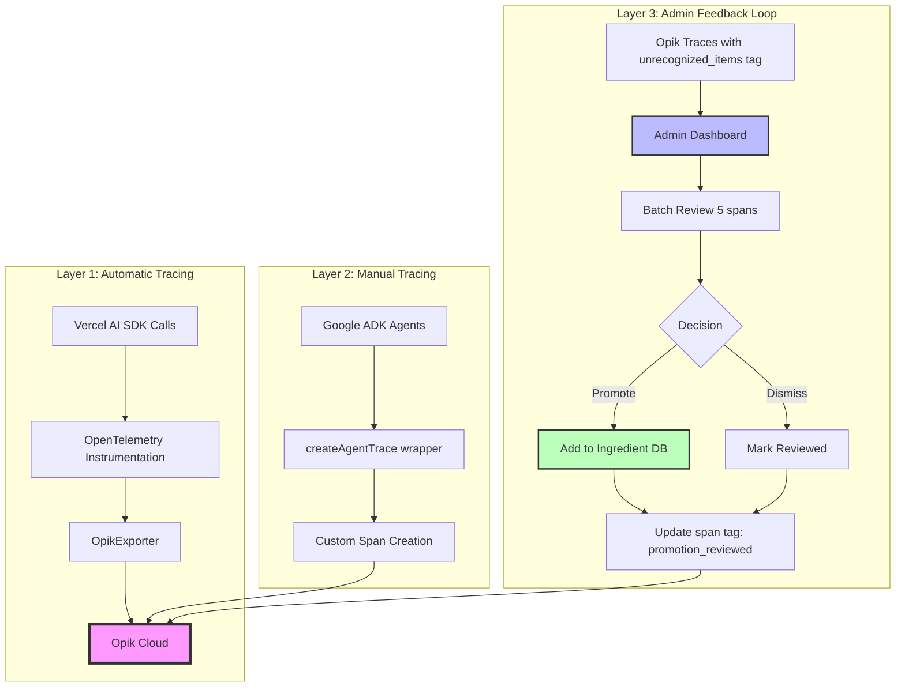

**Layer 1 (Automatic)**: Zero-config tracing via `instrumentation.ts` with OpikExporter

**Layer 2 (Manual)**: Custom wrappers for ADK agents with span hierarchy -> Parent trace + child spans

**Layer 3 (Feedback)**: Direct API integration for span querying and tag management -> leveraging Opik search index (eventually consistent)

**Implementation**: [`apps/nextjs/src/instrumentation.ts`](../apps/nextjs/src/instrumentation.ts) | [`apps/nextjs/src/lib/tracing/opik-agent.ts`](../apps/nextjs/src/lib/tracing/opik-agent.ts) | [`apps/nextjs/src/lib/services/opik-spans.ts`](../apps/nextjs/src/lib/services/opik-spans.ts)

**Screenshots: Manually traced sequential agents calls - Transcriptor + Agentic Loop Agents**

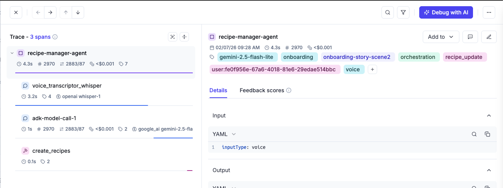
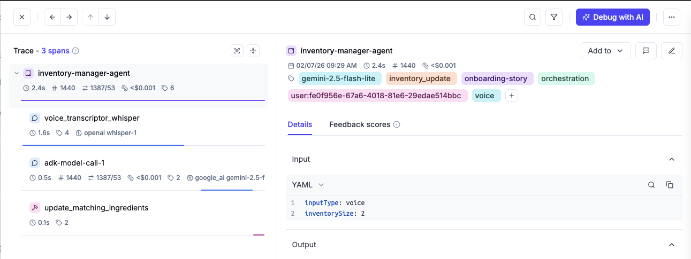


## 📊 Dashboard

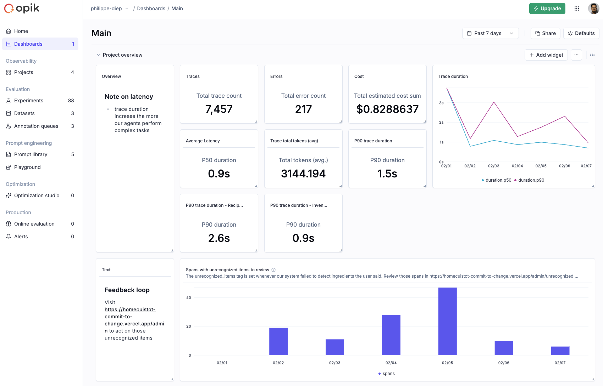

Link: https://www.comet.com/opik/philippe-diep/dashboards/019c1eaa-3cb1-76c0-b9fd-ee27ee6a5d6f

---

## 🎯 Prompt Management Pipeline

We manage 4 versioned prompts across our agent architecture with automated registration:

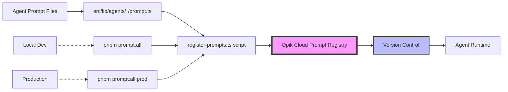

**Prompt Discovery**: Script recursively finds `prompt.ts` files -> we can add more agent to our system by following the file naming convention
**Metadata Extraction**: Each prompt includes name, description, tags, environment
**Environment Separation**: Local vs production prompt namespaces

### 4 Managed Prompts

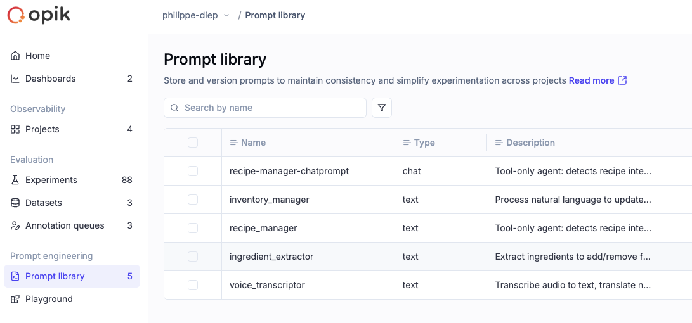

- **Voice Transcriptor** - English extraction from multilingual audio
- **Ingredient Extractor** - Add/remove operations with auto-translation
- **Recipe Manager** - CRUD with create/update/delete/delete_all tools
- **Inventory Manager** - Voice-controlled pantry with bulk operations

**Implementation**: [`apps/nextjs/scripts/register-prompts.ts`](../apps/nextjs/scripts/register-prompts.ts)

**Commands**:
```bash
cd apps/nextjs
pnpm prompt:all       # Register to local Opik
pnpm prompt:all:prod  # Register to production Opik
```

---

## 🧪 Evaluation Framework

We built a comprehensive evaluation system with custom metrics and dataset-driven testing:

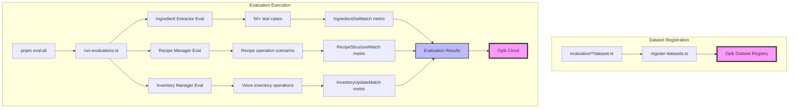

### Custom Evaluation Metrics

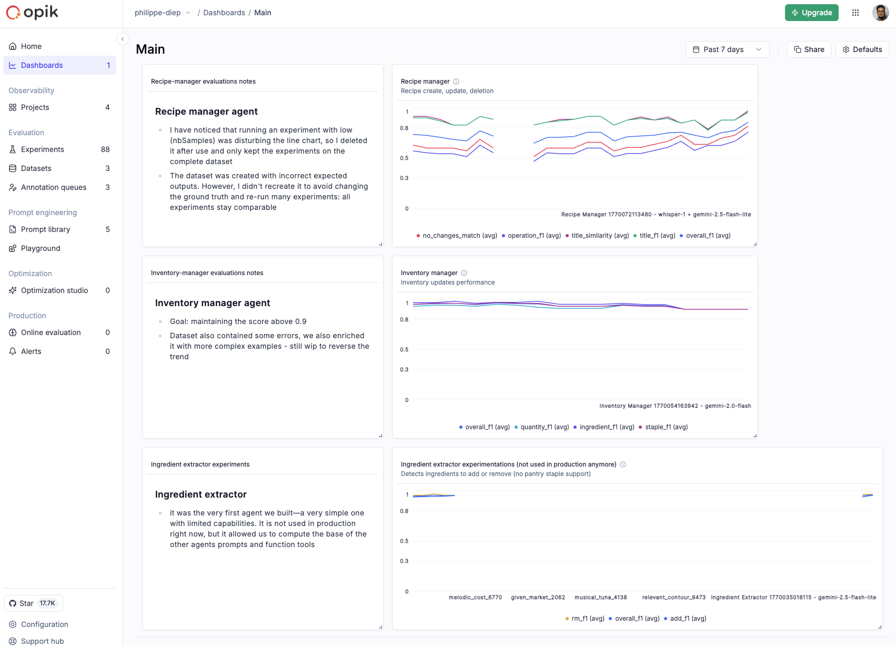

#### IngredientSetMatch (7 scores per evaluation)

- **Add Precision**: % of extracted "add" ingredients that are correct
- **Add Recall**: % of actual "add" ingredients successfully extracted
- **Add F1**: Harmonic mean of add precision and recall
- **Remove Precision**: % of extracted "remove" ingredients that are correct
- **Remove Recall**: % of actual "remove" ingredients successfully extracted
- **Remove F1**: Harmonic mean of remove precision and recall
- **Overall F1**: Average of add F1 and remove F1 (target: >95%)

**Implementation**: [`apps/nextjs/evaluation/ingredient-extractor/metrics/IngredientSetMatch.ts`](../apps/nextjs/evaluation/ingredient-extractor/metrics/IngredientSetMatch.ts)

---

#### RecipeOperationMatch (10 scores per evaluation)

- **Operation Precision**: % of extracted operations that are correct (create/update/delete)
- **Operation Recall**: % of actual operations successfully extracted
- **Operation F1**: Harmonic mean of operation precision and recall
- **Title Precision**: % of recipe titles matched using Levenshtein distance (70% threshold)
- **Title Recall**: % of expected recipe titles successfully matched
- **Title F1**: Harmonic mean of title precision and recall
- **Title Similarity**: Average `Levenshtein` similarity ratio for matched titles (JS implementation of Levenshtein)
- **Overall F1**: Average of operation F1 and title F1
- **No Changes Match**: Binary score (1.0 if noChangesDetected flags match)
- **Structure Match**: Binary validation of proposal structure (recipes array + fields)

**Implementation**: [`apps/nextjs/evaluation/recipe-manager/metrics/RecipeOperationMatch.ts`](../apps/nextjs/evaluation/recipe-manager/metrics/RecipeOperationMatch.ts)

---

#### InventoryUpdateMatch (11 scores per evaluation)

- **Ingredient Precision**: % of extracted ingredients that are correct
- **Ingredient Recall**: % of actual ingredients successfully extracted
- **Ingredient F1**: Harmonic mean of ingredient precision and recall
- **Quantity Precision**: % of quantity levels (0-3) correctly assigned
- **Quantity Recall**: % of expected quantity levels successfully assigned
- **Quantity F1**: Harmonic mean of quantity precision and recall
- **Staple Precision**: % of pantry staple flags correctly assigned
- **Staple Recall**: % of expected pantry staple flags successfully assigned
- **Staple F1**: Harmonic mean of staple precision and recall
- **Overall F1**: Average of ingredient F1, quantity F1, and staple F1
- **Unrecognized Count Match**: Binary score (1.0 if unrecognized counts match)

**Implementation**: [`apps/nextjs/evaluation/inventory-manager/metrics/InventoryUpdateMatch.ts`](../apps/nextjs/evaluation/inventory-manager/metrics/InventoryUpdateMatch.ts)

---

### Evaluation Datasets

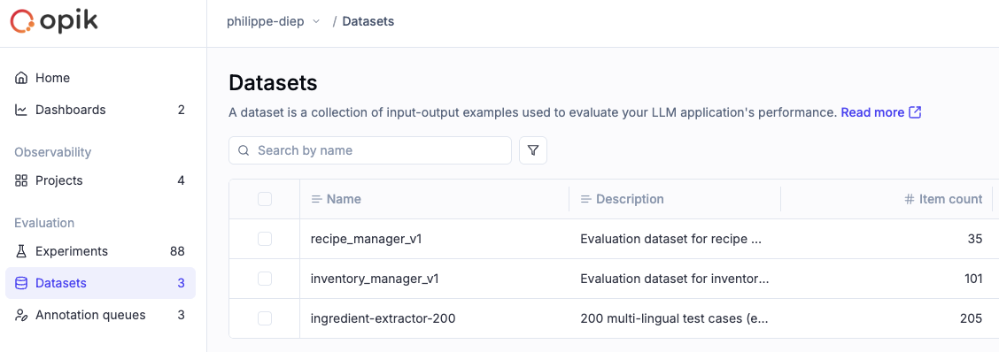

**Ingredient Extractor (50+ test cases)**:
- Multilingual input (English, French, Spanish, German)
- Edge cases: profanity, vague inputs, compound ingredients
- Batch operations: "refill everything", "delete all non-staples"

**Recipe Manager**:
- Recipe creation scenarios
- Ingredient updates (add/remove/toggle optional)
- Batch delete operations

**Inventory Manager**:
- Voice-controlled refill/delete/update quantity
- Bulk operations with filtering
- Pantry staple handling

**Commands**:
```bash
cd apps/nextjs
pnpm dataset:register  # Register all datasets to Opik
pnpm eval              # Run single evaluation (e.g., pnpm eval ingredient-extractor 10)
pnpm eval:all          # Run all evaluations
```

**Implementation**: [`apps/nextjs/scripts/register-datasets.ts`](../apps/nextjs/scripts/register-datasets.ts) | [`apps/nextjs/scripts/run-evaluations.ts`](../apps/nextjs/scripts/run-evaluations.ts)

---

## 🔄 Continuous Improvement Loop!

This is where Opik becomes the measurement layer for continuous system improvement. Here's how we turn real user interactions into database enrichment:

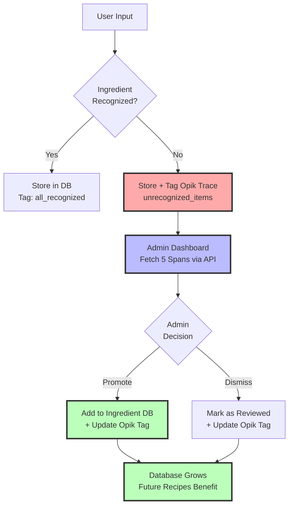

**Screenshot**

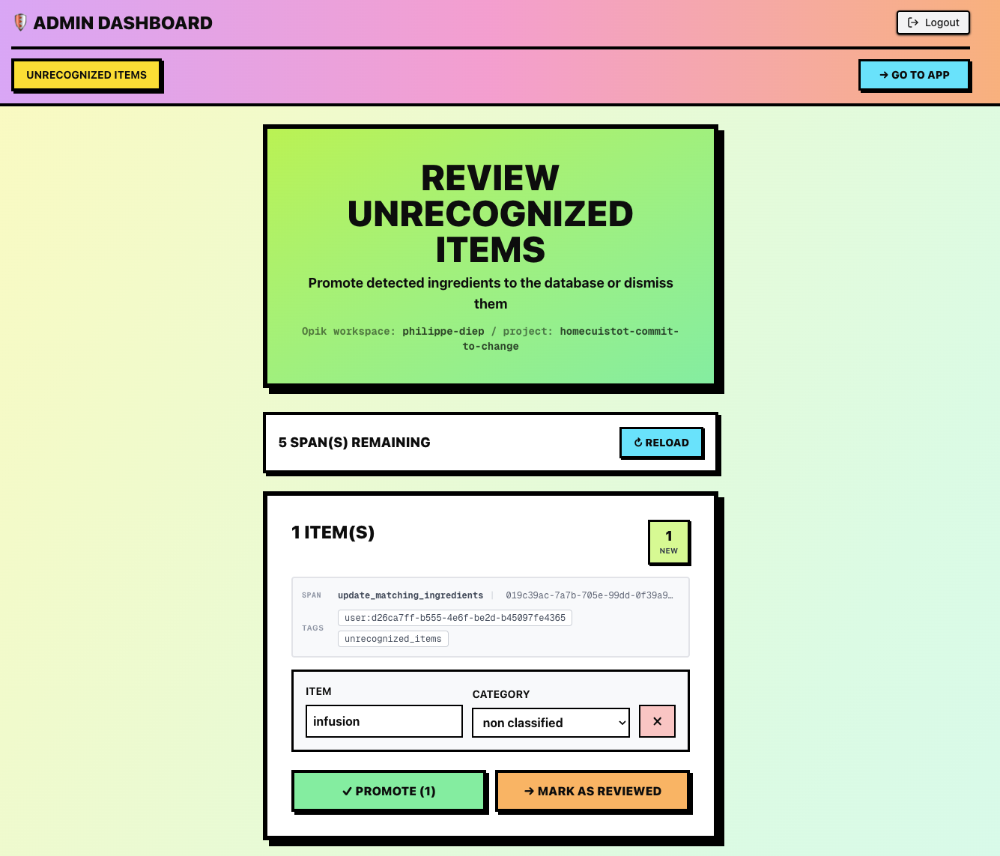

### Technical Deep-Dive

#### Step 1: Tag Traces During Agent Execution

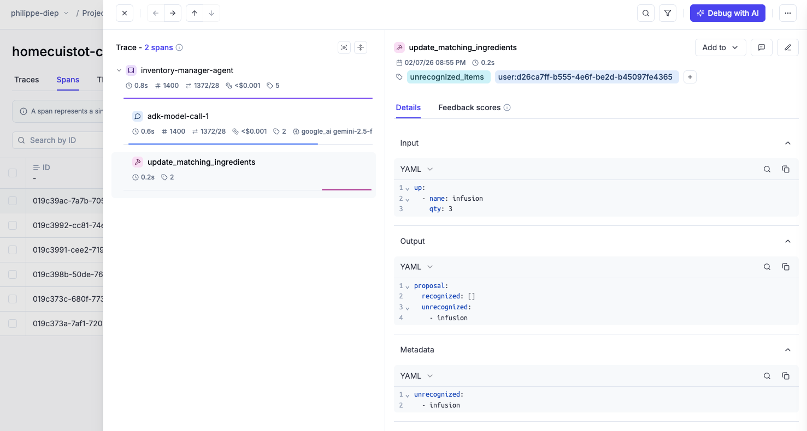

When the Recipe Manager agent encounters unrecognized ingredients, we tag the Opik trace:

```typescript
// During agent orchestration
const unrecognizedItems = proposal.items.filter(item => !item.recognized);
const tags = unrecognizedItems.length > 0
  ? ['unrecognized_items', `user:${userId}`]
  : ['all_recognized', `user:${userId}`];

traceCtx.trace.update({
  metadata: { unrecognizedItems },
  tags
});
```

#### Step 2: Query Spans via Direct Opik API

Admin dashboard fetches unprocessed spans using tag-based search:

```typescript
// apps/nextjs/src/lib/services/opik-spans.ts
export async function getNextUnprocessedSpans(limit = 5) {
  // Search for spans tagged "unrecognized_items"
  const searchResults = await fetch(`${OPIK_URL}/spans/search`, {
    method: 'POST',
    body: JSON.stringify({
      filters: [{ field: 'tags', operator: 'contains', value: 'unrecognized_items' }],
      limit
    })
  });

  // IMPORTANT: Fetch by ID to bypass stale search index
  const spans = await Promise.all(
    searchResults.map(span => getSpanById(span.id))
  );

  return spans;
}
```

**Why `getSpanById()`?** [Span search API](https://www.comet.com/docs/opik/reference/rest-api/spans/search-spans) serves stale data after tag updates (eventually consistent). Fetching by ID guarantees authoritative state.

#### Step 3: Batch Review Interface

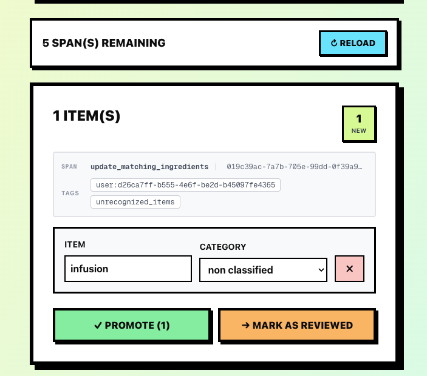

Admin reviews 5 spans at a time, assigns categories, promotes or dismisses:

```typescript
// apps/nextjs/src/app/(admin)/admin/unrecognized/page.tsx
const handlePromoteSpan = async (span) => {
  // Promote selected items to ingredient database
  await fetch('/api/admin/ingredients/promote', {
    method: 'POST',
    body: JSON.stringify({
      spanId: span.spanId,
      promotions: [
        { name: 'greek yogurt', category: 'dairy' },
        { name: 'sriracha', category: 'condiments' }
      ]
    })
  });
};
```

#### Step 4: Update Opik Tags

After promotion, we swap the span tag to mark it as reviewed:

```typescript
// apps/nextjs/src/lib/services/opik-spans.ts
export async function markSpanAsReviewed(spanId: string) {
  const span = await getSpanById(spanId);

  // Remove "unrecognized_items", add "promotion_reviewed"
  const updatedTags = span.tags
    .filter(tag => tag !== 'unrecognized_items')
    .concat('promotion_reviewed');

  await fetch(`${OPIK_URL}/spans/${spanId}`, {
    method: 'PATCH',
    body: JSON.stringify({ tags: updatedTags })
  });
}
```

#### Step 5: Database Grows, Future Recipes Benefit

Once promoted, ingredients are recognized automatically in future agent calls. The database grows from 5,931 → continuously enriched based on real user patterns.

**Implementation**: [`apps/nextjs/src/app/(admin)/admin/unrecognized/page.tsx`](../apps/nextjs/src/app/(admin)/admin/unrecognized/page.tsx) | [`apps/nextjs/src/lib/services/opik-spans.ts`](../apps/nextjs/src/lib/services/opik-spans.ts)

---

## 🏷️ Annotation Queues for Prompt Improvement

Beyond the automated feedback loop, we leverage **Opik Annotation Queues** to manually review and annotate traces from specific users for targeted prompt improvements.

### Use Case: Test User Analysis

When testing the app with specific users (e.g. beta testers), we create annotation queues filtered by `user:id` tag to:

1. **Review all interactions** from a specific test session
2. **Identify edge cases** where prompts could be improved
3. **Annotate failures** with improvement notes

### Screenshot

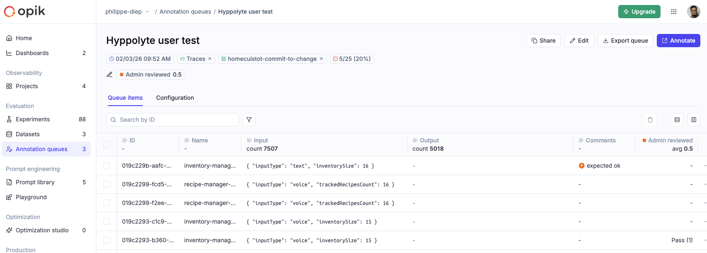

### Benefits

✅ **Targeted analysis**: Focus on specific user journeys

✅ **Pattern identification**: Spot recurring issues across users

**This complements the automated continuous improvement loop** - while the admin promotion workflow handles ingredient database enrichment automatically, annotation queues enable manual prompt refinement based on real user sessions.

---

## 🔧 Integration Challenges & Solutions

### Challenge 1: OpenAI Whisper Token Tracking

**Issue**: `opik-openai` doesn't capture Whisper response format for token counting (or we misconfigured it).

**Solution**: Manual span creation with token metadata extraction

**Result**: Full visibility into transcription costs

**Code**: [`apps/nextjs/src/lib/agents/voice-transcriptor/agent.ts:45-60`](../apps/nextjs/src/lib/agents/voice-transcriptor/agent.ts)

---

### Challenge 2: Google ADK-js Tracing

**Issue**: No native OpenTelemetry support in ADK-js (only Python support). We could have rebuilt an opik integration via Google ADK callback system, but it was too tedious → we decided to continue with custom traces, only tracing the tools we implemented.

**Solution**: Custom `createAgentTrace()` wrapper for sequential agent calls

**Result**: 1 trace per multi-agent flow with proper span hierarchy

**Code**: [`apps/nextjs/src/lib/tracing/opik-agent.ts`](../apps/nextjs/src/lib/tracing/opik-agent.ts)

---

### Challenge 3: Vercel AI SDK ThreadId Support

**Issue**: TypeScript types incomplete for `threadId` parameter

**Action**: Opened GitHub feature request [comet-ml/opik#4798](https://github.com/comet-ml/opik/issues/4798)

**Workaround**: Custom trace management until upstream fix, but in the end, we chose Google ADK.

---

### Challenge 4: Span Search API Stale Data

**Issue**: After updating span tags, search API served stale results for a moment (at least locally).

**Debugging**: An hour lost before discovering index lag

**Solution**: Fetch by span ID for authoritative state after tag updates

**Code**: [`getSpanById()` function in `opik-spans.ts`](../apps/nextjs/src/lib/services/opik-spans.ts)

---

## 🚀 Next steps

### Audio datasets

We prepared audio files in our [evaluation](apps/nextjs/evaluation) folder, but we didn't had enough time to rebuild dataset due to the Hackathon deadlines.

### More granular Dataset approach

We should have created dataset with more specialized examples, to better scope our scorer to one aspect of the agent performance.

E.g. The recipe-manager is graded on its capabilities to correctly: Create, update, delete. We should have created dataset for each ones, to better scope our scorer and better analyze the improvements of our prompt because it was hard to decypher which aspect of the agent was poorly performing. Learning for next time...

## ✅ Summary

This Opik integration provides:

✅ **Full observability** across automatic, manual, and feedback-driven tracing

✅ **Versioned prompts** with environment separation (local/production)

✅ **Custom evaluation metrics** with F1 scoring for precision/recall analysis

✅ **Continuous improvement** via admin promotion workflow

✅ **Annotation queues** for targeted prompt improvement from user test sessions

The system is production-ready with comprehensive measurement layers for iterative agent improvement.

**[← Back to README](../README.md)** | **[View Development Approach →](DEVELOPMENT_APPROACH.md)**
