# AI Agent Design Document - Homecuistot Kitchen Assistant

## Table of Contents

1. [Executive Summary](#executive-summary)
2. [Current Architecture Analysis](#current-architecture-analysis)
3. [Proposed Agent Capabilities](#proposed-agent-capabilities)
4. [Design Approach 1: Vercel AI SDK - Single Agent with Tools](#design-1-vercel-ai-sdk---single-agent-with-tools)
5. [Design Approach 2: Vercel AI SDK - Multi-Agent Router](#design-2-vercel-ai-sdk---multi-agent-router)
6. [Design Approach 3: Vercel AI SDK - Streaming Agent with UI Components](#design-3-vercel-ai-sdk---streaming-agent-with-ui-components)
7. [Design Approach 4: Google ADK-JS - Single Agent with Function Declarations](#design-4-google-adk-js---single-agent-with-function-declarations)
8. [Design Approach 5: Google ADK-JS - Hierarchical Agent System](#design-5-google-adk-js---hierarchical-agent-system)
9. [Design Approach 6: Google ADK-JS - Event-Driven Agent with Sessions](#design-6-google-adk-js---event-driven-agent-with-sessions)
10. [Opik Tracing Integration](#opik-tracing-integration)
11. [Prompt Engineering Guidelines](#prompt-engineering-guidelines)
12. [Guardrails & Safety](#guardrails--safety)
13. [Recommendation & Trade-offs](#recommendation--trade-offs)

---

## Executive Summary

This document outlines 6 comprehensive AI agent architectures for the Homecuistot kitchen assistant, split between:
- **3 designs using Vercel AI SDK** (streaming-first, React Server Components integration)
- **3 designs using Google ADK-JS** (native Gemini function calling)

The agent will enable users to manage recipes and ingredients through natural conversation (voice or text), performing actions like:
- Create, update, delete recipes
- Mark recipes as cooked (with inventory deduction)
- Add/remove ingredients from inventory
- Manage quantity levels (0-3 scale)
- Toggle pantry staple status
- Query cookable recipes based on current inventory

---

## Current Architecture Analysis

### Existing LLM Prompts

| Prompt | Purpose | Input | Output |
|--------|---------|-------|--------|
| `inventory-update` | Extract ingredient quantities from voice/text | Audio/Text | `{ingredientName, quantityLevel}[]` |
| `onboarding-voice` | Extract dishes/ingredients during setup | Audio + context | `{add/remove: {dishes, ingredients}}` |
| `onboarding-text` | Text-based onboarding extraction | Text + context | `{add/remove: {dishes, ingredients}}` |
| `recipe-generation` | Generate recipe details from dish names | Dish names[] | `{dishName, description, ingredients}[]` |
| `recipe-editor` | Extract recipe from voice/text | Audio/Text | `{title, description, ingredients[]}` |
| `recipe-updater` | Update existing recipe | Current recipe + changes | Updated recipe state |

### Current Data Flow

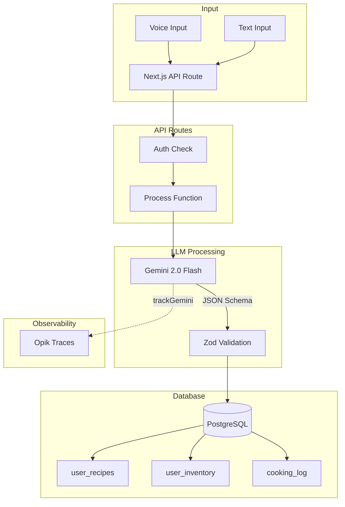

### Database Schema Summary

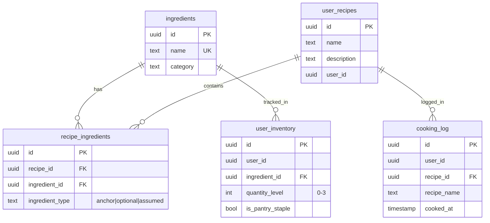

---

## Proposed Agent Capabilities

### Core Actions (Tools)

| Tool Name | Description | Parameters | Returns |
|-----------|-------------|------------|---------|
| `createRecipe` | Create new recipe | `{name, description, ingredients[]}` | Recipe ID |
| `updateRecipe` | Update existing recipe | `{recipeId, updates}` | Updated recipe |
| `deleteRecipe` | Delete a recipe | `{recipeId}` | Success boolean |
| `getRecipes` | List user's recipes | `{filters?, limit?}` | Recipe[] |
| `getRecipeDetails` | Get single recipe | `{recipeId}` | Recipe with ingredients |
| `markAsCooked` | Log cooking & deduct inventory | `{recipeId}` | Cooking log entry |
| `addToInventory` | Add ingredient to inventory | `{ingredientName, quantity}` | Inventory entry |
| `updateInventory` | Update quantity level | `{ingredientId, quantityLevel}` | Updated entry |
| `removeFromInventory` | Remove from inventory | `{ingredientId}` | Success boolean |
| `getInventory` | List inventory items | `{filters?}` | Inventory[] |
| `togglePantryStaple` | Mark/unmark as staple | `{ingredientId}` | Updated entry |
| `getCookableRecipes` | Find recipes user can make | `{threshold?}` | Recipe[] with match % |
| `searchIngredients` | Search ingredient database | `{query}` | Ingredient[] |

### Conversation Intents

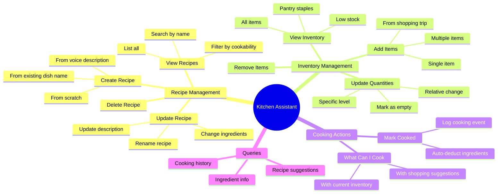

---

## Design 1: Vercel AI SDK - Single Agent with Tools

### Overview

A unified agent with all tools exposed directly. Simple to implement and maintain, ideal for getting started quickly.

### Architecture

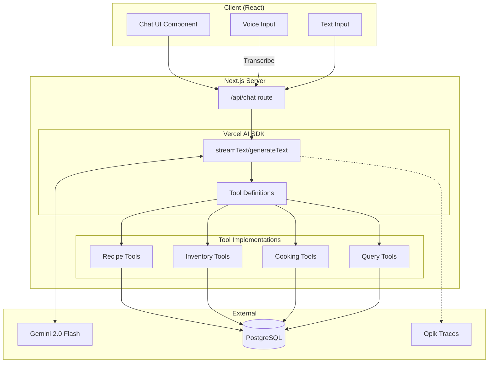

### Implementation Structure

```
apps/nextjs/src/
├── app/api/chat/
│   └── route.ts              # Main chat endpoint
├── lib/agent/
│   ├── index.ts              # Agent configuration
│   ├── system-prompt.ts      # System prompt definition
│   └── tools/
│       ├── index.ts          # Tool registry
│       ├── recipe-tools.ts   # Recipe CRUD tools
│       ├── inventory-tools.ts # Inventory tools
│       ├── cooking-tools.ts  # Cooking actions
│       └── query-tools.ts    # Read-only queries
```

### Code Example

```typescript
// apps/nextjs/src/app/api/chat/route.ts
import { streamText } from 'ai';
import { google } from '@ai-sdk/google';
import { OpikExporter } from 'opik-vercel';
import { tools } from '@/lib/agent/tools';
import { SYSTEM_PROMPT } from '@/lib/agent/system-prompt';

export async function POST(req: Request) {
  const { messages } = await req.json();
  const userId = await getUserId(req); // Auth check

  const result = streamText({
    model: google('gemini-2.0-flash'),
    system: SYSTEM_PROMPT,
    messages,
    tools,
    toolChoice: 'auto',
    maxSteps: 10, // Allow multi-turn tool use
    experimental_telemetry: OpikExporter.getSettings({
      functionId: 'kitchen-assistant',
      metadata: { userId },
    }),
  });

  return result.toDataStreamResponse();
}
```

```typescript
// apps/nextjs/src/lib/agent/tools/recipe-tools.ts
import { tool } from 'ai';
import { z } from 'zod';
import { db } from '@/db';
import { userRecipes, recipeIngredients } from '@/db/schema';

export const createRecipe = tool({
  description: 'Create a new recipe with name, description, and ingredients',
  parameters: z.object({
    name: z.string().describe('Recipe name'),
    description: z.string().optional().describe('Brief description'),
    ingredients: z.array(z.object({
      name: z.string(),
      type: z.enum(['anchor', 'optional', 'assumed']).default('anchor'),
    })).describe('List of ingredients with their importance'),
  }),
  execute: async ({ name, description, ingredients }, { userId }) => {
    // 1. Create recipe
    const [recipe] = await db.insert(userRecipes).values({
      name,
      description,
      userId,
    }).returning();

    // 2. Link ingredients (resolve names to IDs)
    for (const ing of ingredients) {
      const ingredient = await findOrLogIngredient(ing.name, userId);
      if (ingredient) {
        await db.insert(recipeIngredients).values({
          recipeId: recipe.id,
          ingredientId: ingredient.id,
          ingredientType: ing.type,
        });
      }
    }

    return { success: true, recipeId: recipe.id, name };
  },
});
```

### Pros & Cons

| Pros | Cons |
|------|------|
| Simple, single entry point | Can become overwhelming with many tools |
| Easy to test and debug | No separation of concerns |
| Lower latency (no routing) | Harder to scale team development |
| Straightforward streaming | All tools always available (potential confusion) |

---

## Design 2: Vercel AI SDK - Multi-Agent Router

### Overview

A router agent delegates to specialized sub-agents based on intent. Each sub-agent has focused tools and prompts for its domain.

### Architecture

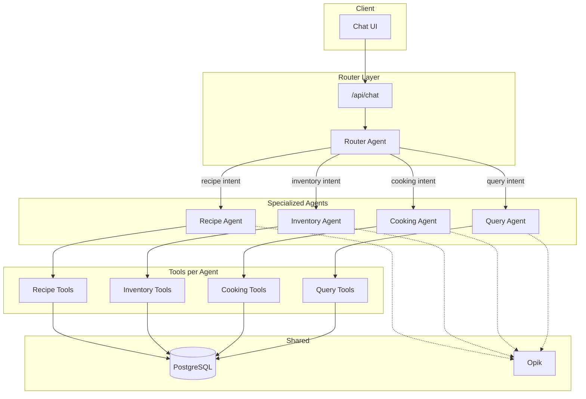

### Sub-Agent Definitions

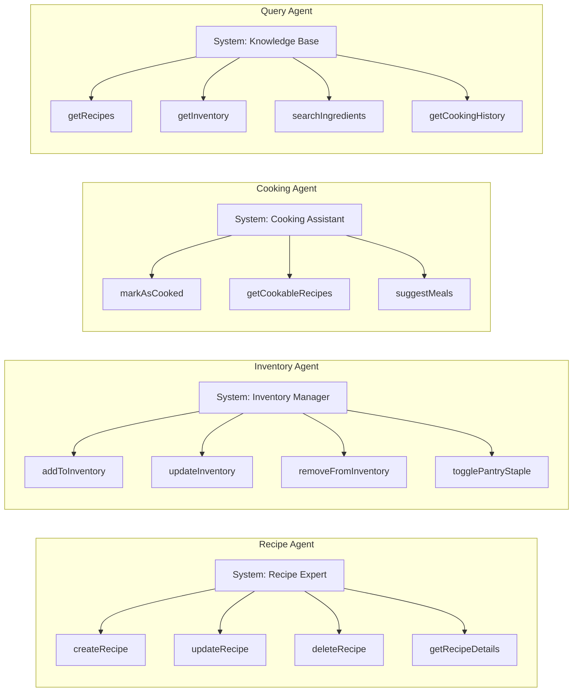

### Implementation

```typescript
// apps/nextjs/src/lib/agent/router.ts
import { generateText } from 'ai';
import { google } from '@ai-sdk/google';
import { z } from 'zod';

const ROUTER_PROMPT = `You are a kitchen assistant router. Analyze the user's message and determine which specialized agent should handle it.

Agents available:
- RECIPE: Creating, updating, deleting, or viewing recipes
- INVENTORY: Managing ingredient quantities, pantry staples
- COOKING: Marking meals as cooked, finding what can be cooked
- QUERY: General questions, searching, history

Respond with the agent name only.`;

export async function routeMessage(message: string): Promise<AgentType> {
  const { text } = await generateText({
    model: google('gemini-2.0-flash'),
    system: ROUTER_PROMPT,
    prompt: message,
  });

  return text.trim().toUpperCase() as AgentType;
}
```

```typescript
// apps/nextjs/src/app/api/chat/route.ts
import { streamText } from 'ai';
import { routeMessage } from '@/lib/agent/router';
import { agents } from '@/lib/agent/agents';

export async function POST(req: Request) {
  const { messages } = await req.json();
  const lastMessage = messages[messages.length - 1].content;

  // Route to appropriate agent
  const agentType = await routeMessage(lastMessage);
  const agent = agents[agentType];

  const result = streamText({
    model: google('gemini-2.0-flash'),
    system: agent.systemPrompt,
    messages,
    tools: agent.tools,
    experimental_telemetry: OpikExporter.getSettings({
      functionId: `kitchen-${agentType.toLowerCase()}`,
    }),
  });

  return result.toDataStreamResponse();
}
```

### Pros & Cons

| Pros | Cons |
|------|------|
| Focused, specialized prompts | Extra routing latency |
| Easier to maintain/test per agent | Conversation context can be lost between agents |
| Clear separation of concerns | More complex state management |
| Agents can evolve independently | Routing errors affect UX |

---

## Design 3: Vercel AI SDK - Streaming Agent with UI Components

### Overview

Leverages Vercel AI SDK's `streamUI` to stream React components directly. Tools return UI components instead of raw data, enabling rich interactive responses.

### Architecture

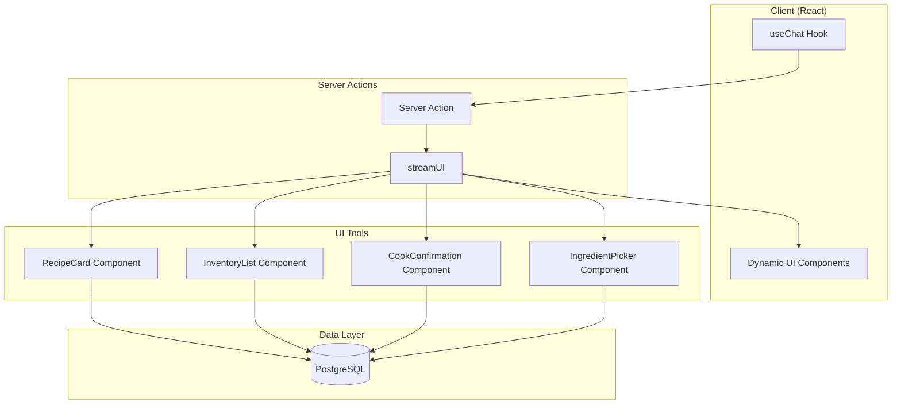

### Component Flow

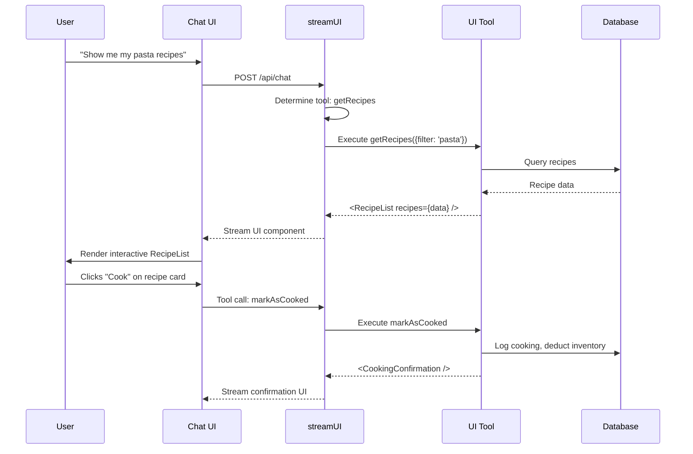

### Implementation

```typescript
// apps/nextjs/src/app/actions/chat.tsx
'use server';

import { streamUI } from 'ai/rsc';
import { google } from '@ai-sdk/google';
import { z } from 'zod';
import { RecipeCard } from '@/components/ai/recipe-card';
import { InventoryGrid } from '@/components/ai/inventory-grid';
import { CookingConfirmation } from '@/components/ai/cooking-confirmation';

export async function submitMessage(message: string) {
  const result = await streamUI({
    model: google('gemini-2.0-flash'),
    system: KITCHEN_ASSISTANT_PROMPT,
    prompt: message,
    tools: {
      showRecipes: {
        description: 'Display recipes in an interactive grid',
        parameters: z.object({
          filter: z.string().optional(),
          showCookable: z.boolean().optional(),
        }),
        generate: async function* ({ filter, showCookable }) {
          yield <div className="animate-pulse">Loading recipes...</div>;

          const recipes = await getRecipesFromDB(filter, showCookable);

          return (
            <div className="grid grid-cols-2 gap-4">
              {recipes.map(recipe => (
                <RecipeCard
                  key={recipe.id}
                  recipe={recipe}
                  onCook={() => markAsCooked(recipe.id)}
                  onEdit={() => openEditor(recipe.id)}
                />
              ))}
            </div>
          );
        },
      },

      showInventory: {
        description: 'Display inventory with quantity controls',
        parameters: z.object({
          showLowStock: z.boolean().optional(),
          showPantryOnly: z.boolean().optional(),
        }),
        generate: async function* ({ showLowStock, showPantryOnly }) {
          yield <div className="animate-pulse">Loading inventory...</div>;

          const inventory = await getInventoryFromDB(showLowStock, showPantryOnly);

          return (
            <InventoryGrid
              items={inventory}
              onUpdateQuantity={updateInventoryQuantity}
              onToggleStaple={togglePantryStaple}
            />
          );
        },
      },

      confirmCooking: {
        description: 'Confirm cooking a recipe and show what will be deducted',
        parameters: z.object({
          recipeId: z.string(),
        }),
        generate: async function* ({ recipeId }) {
          const recipe = await getRecipeWithIngredients(recipeId);
          const deductions = await calculateDeductions(recipe);

          return (
            <CookingConfirmation
              recipe={recipe}
              deductions={deductions}
              onConfirm={() => executeCooking(recipeId)}
              onCancel={() => {}}
            />
          );
        },
      },
    },
  });

  return result.value;
}
```

```typescript
// apps/nextjs/src/components/ai/recipe-card.tsx
'use client';

import { Card, CardHeader, CardContent, CardFooter } from '@/components/ui/card';
import { Button } from '@/components/ui/button';
import { Badge } from '@/components/ui/badge';

interface RecipeCardProps {
  recipe: Recipe;
  matchPercentage?: number;
  onCook: () => void;
  onEdit: () => void;
}

export function RecipeCard({ recipe, matchPercentage, onCook, onEdit }: RecipeCardProps) {
  return (
    <Card className="retro-card">
      <CardHeader>
        <h3 className="font-bold">{recipe.name}</h3>
        {matchPercentage !== undefined && (
          <Badge variant={matchPercentage >= 80 ? 'success' : 'warning'}>
            {matchPercentage}% match
          </Badge>
        )}
      </CardHeader>
      <CardContent>
        <p className="text-sm text-muted">{recipe.description}</p>
        <div className="flex flex-wrap gap-1 mt-2">
          {recipe.ingredients.map(ing => (
            <Badge key={ing.id} variant="outline" size="sm">
              {ing.name}
            </Badge>
          ))}
        </div>
      </CardContent>
      <CardFooter className="flex gap-2">
        <Button onClick={onCook} variant="primary">Cook</Button>
        <Button onClick={onEdit} variant="secondary">Edit</Button>
      </CardFooter>
    </Card>
  );
}
```

### Pros & Cons

| Pros | Cons |
|------|------|
| Rich, interactive UI responses | More complex to implement |
| Native React component streaming | Harder to test (UI in tools) |
| Progressive loading states | Tightly coupled to React |
| Actions embedded in response | Less portable (not just text) |

---

## Design 4: Google ADK-JS - Single Agent with Function Declarations

### Overview

Uses Google's native function calling with `@google/genai`. All tools defined as Gemini function declarations with automatic JSON schema generation.

### Architecture

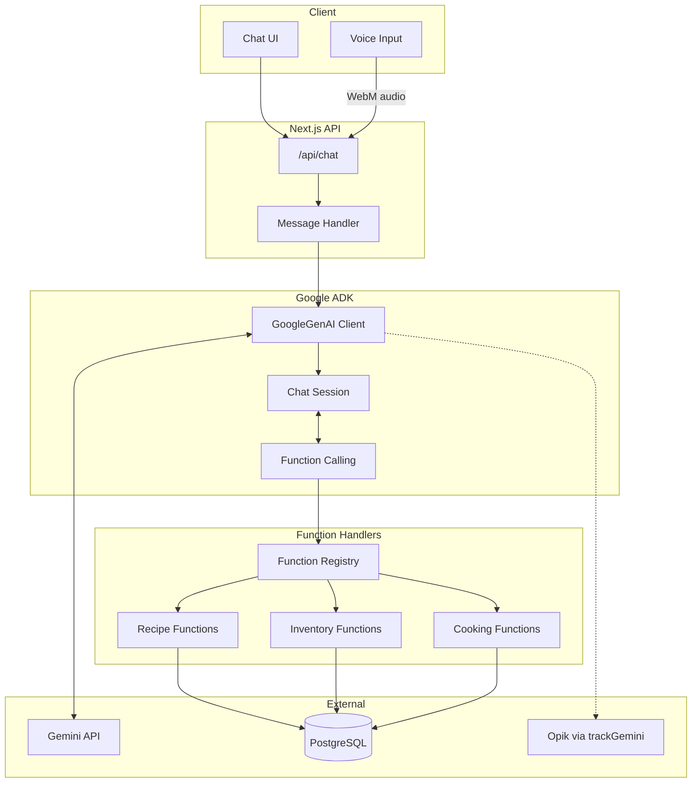

### Function Declaration Schema

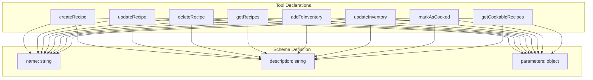

### Implementation

```typescript
// apps/nextjs/src/lib/agent-adk/client.ts
import { GoogleGenAI, Type } from '@google/genai';
import { trackGemini } from 'opik-gemini';

const genAI = new GoogleGenAI({
  apiKey: process.env.GOOGLE_GENERATIVE_AI_API_KEY!,
});

export const trackedGenAI = trackGemini(genAI, {
  generationName: 'kitchen-assistant-agent',
  traceMetadata: {
    tags: ['agent', 'kitchen-assistant', 'function-calling'],
    domain: 'kitchen',
    inputType: 'chat',
  },
});
```

```typescript
// apps/nextjs/src/lib/agent-adk/tools.ts
import { Type, FunctionDeclaration } from '@google/genai';

export const toolDeclarations: FunctionDeclaration[] = [
  {
    name: 'createRecipe',
    description: 'Create a new recipe with a name, description, and list of ingredients',
    parameters: {
      type: Type.OBJECT,
      properties: {
        name: {
          type: Type.STRING,
          description: 'The name of the recipe',
        },
        description: {
          type: Type.STRING,
          description: 'A brief description of the recipe (max 50 words)',
        },
        ingredients: {
          type: Type.ARRAY,
          items: {
            type: Type.OBJECT,
            properties: {
              name: { type: Type.STRING, description: 'Ingredient name' },
              isOptional: { type: Type.BOOLEAN, description: 'Whether ingredient is optional' },
            },
            required: ['name'],
          },
          description: 'List of ingredients (1-20 items)',
        },
      },
      required: ['name', 'ingredients'],
    },
  },
  {
    name: 'updateInventory',
    description: 'Update the quantity level of an ingredient in inventory (0=empty, 1=low, 2=some, 3=full)',
    parameters: {
      type: Type.OBJECT,
      properties: {
        ingredientName: {
          type: Type.STRING,
          description: 'Name of the ingredient to update',
        },
        quantityLevel: {
          type: Type.INTEGER,
          description: 'Quantity level from 0 (empty) to 3 (full)',
        },
      },
      required: ['ingredientName', 'quantityLevel'],
    },
  },
  {
    name: 'markAsCooked',
    description: 'Mark a recipe as cooked, logging the cooking event and optionally deducting ingredients from inventory',
    parameters: {
      type: Type.OBJECT,
      properties: {
        recipeId: {
          type: Type.STRING,
          description: 'The ID of the recipe that was cooked',
        },
        deductIngredients: {
          type: Type.BOOLEAN,
          description: 'Whether to automatically reduce inventory quantities',
        },
      },
      required: ['recipeId'],
    },
  },
  {
    name: 'getCookableRecipes',
    description: 'Find recipes the user can cook with their current inventory',
    parameters: {
      type: Type.OBJECT,
      properties: {
        minimumMatchPercentage: {
          type: Type.INTEGER,
          description: 'Minimum percentage of ingredients user must have (default: 80)',
        },
        includePantryStaples: {
          type: Type.BOOLEAN,
          description: 'Whether to count pantry staples as available (default: true)',
        },
      },
    },
  },
  // ... more tool declarations
];
```

```typescript
// apps/nextjs/src/lib/agent-adk/handlers.ts
import { db } from '@/db';
import { userRecipes, recipeIngredients, userInventory, cookingLog } from '@/db/schema';

export const functionHandlers: Record<string, (args: any, userId: string) => Promise<any>> = {
  async createRecipe({ name, description, ingredients }, userId) {
    const [recipe] = await db.insert(userRecipes).values({
      name,
      description,
      userId,
    }).returning();

    // Resolve and link ingredients
    const linkedIngredients = await linkIngredients(recipe.id, ingredients, userId);

    return {
      success: true,
      recipe: { id: recipe.id, name, description, ingredients: linkedIngredients },
    };
  },

  async updateInventory({ ingredientName, quantityLevel }, userId) {
    const ingredient = await findIngredientByName(ingredientName);
    if (!ingredient) {
      return { success: false, error: `Ingredient "${ingredientName}" not found` };
    }

    await db
      .insert(userInventory)
      .values({ userId, ingredientId: ingredient.id, quantityLevel })
      .onConflictDoUpdate({
        target: [userInventory.userId, userInventory.ingredientId],
        set: { quantityLevel, updatedAt: new Date() },
      });

    return { success: true, ingredient: ingredient.name, quantityLevel };
  },

  async markAsCooked({ recipeId, deductIngredients = true }, userId) {
    const recipe = await getRecipeWithIngredients(recipeId);
    if (!recipe) {
      return { success: false, error: 'Recipe not found' };
    }

    // Log cooking event
    await db.insert(cookingLog).values({
      userId,
      recipeId,
      recipeName: recipe.name,
    });

    // Optionally deduct ingredients
    if (deductIngredients) {
      await deductIngredientsFromInventory(userId, recipe.ingredients);
    }

    return { success: true, message: `Marked "${recipe.name}" as cooked` };
  },

  async getCookableRecipes({ minimumMatchPercentage = 80, includePantryStaples = true }, userId) {
    const inventory = await getUserInventory(userId, includePantryStaples);
    const recipes = await getUserRecipes(userId);

    const cookableRecipes = recipes
      .map(recipe => ({
        ...recipe,
        matchPercentage: calculateMatchPercentage(recipe.ingredients, inventory),
      }))
      .filter(r => r.matchPercentage >= minimumMatchPercentage)
      .sort((a, b) => b.matchPercentage - a.matchPercentage);

    return { recipes: cookableRecipes };
  },
};
```

```typescript
// apps/nextjs/src/app/api/chat/route.ts
import { trackedGenAI } from '@/lib/agent-adk/client';
import { toolDeclarations } from '@/lib/agent-adk/tools';
import { functionHandlers } from '@/lib/agent-adk/handlers';
import { SYSTEM_PROMPT } from '@/lib/agent-adk/system-prompt';

export async function POST(req: Request) {
  const { messages, userId } = await req.json();

  // Convert messages to Gemini format
  const contents = messagesToContents(messages);

  const response = await trackedGenAI.models.generateContent({
    model: 'gemini-2.0-flash',
    systemInstruction: SYSTEM_PROMPT,
    contents,
    tools: [{ functionDeclarations: toolDeclarations }],
    toolConfig: { functionCallingConfig: { mode: 'AUTO' } },
  });

  // Handle function calls
  const functionCalls = response.candidates?.[0]?.content?.parts?.filter(
    p => p.functionCall
  );

  if (functionCalls?.length) {
    const results = await Promise.all(
      functionCalls.map(async (fc) => {
        const handler = functionHandlers[fc.functionCall!.name];
        const result = await handler(fc.functionCall!.args, userId);
        return {
          functionResponse: {
            name: fc.functionCall!.name,
            response: result,
          },
        };
      })
    );

    // Send function results back for final response
    const finalResponse = await trackedGenAI.models.generateContent({
      model: 'gemini-2.0-flash',
      systemInstruction: SYSTEM_PROMPT,
      contents: [...contents, { role: 'model', parts: functionCalls }, { role: 'function', parts: results }],
    });

    await trackedGenAI.flush();
    return Response.json({ response: finalResponse.text });
  }

  await trackedGenAI.flush();
  return Response.json({ response: response.text });
}
```

### Pros & Cons

| Pros | Cons |
|------|------|
| Native Gemini integration | Manual function call loop |
| Direct control over API calls | No built-in streaming helpers |
| Existing opik-gemini tracing works | More boilerplate code |
| Audio/multimodal native support | Less abstraction than Vercel SDK |

---

## Design 5: Google ADK-JS - Hierarchical Agent System

### Overview

A coordinator agent manages specialized sub-agents. Each sub-agent has focused capabilities and can be invoked via the coordinator's tool calls.

### Architecture

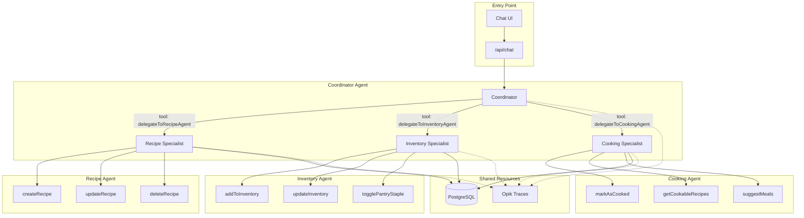

### Agent Hierarchy

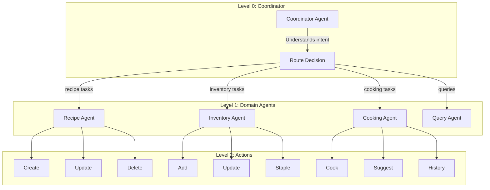

### Implementation

```typescript
// apps/nextjs/src/lib/agent-adk/agents/coordinator.ts
import { GoogleGenAI } from '@google/genai';
import { trackGemini } from 'opik-gemini';
import { recipeAgent } from './recipe-agent';
import { inventoryAgent } from './inventory-agent';
import { cookingAgent } from './cooking-agent';

const COORDINATOR_PROMPT = `You are the Kitchen Assistant Coordinator. Your job is to:
1. Understand the user's intent
2. Delegate to the appropriate specialized agent
3. Synthesize responses back to the user

Available agents:
- Recipe Agent: For creating, updating, deleting, or viewing recipes
- Inventory Agent: For managing ingredient quantities and pantry staples
- Cooking Agent: For logging cooked meals and finding what to cook

Always delegate to the appropriate agent. Never try to handle tasks directly.
If a task spans multiple domains, coordinate between agents.`;

const coordinatorTools = [
  {
    name: 'delegateToRecipeAgent',
    description: 'Delegate recipe-related tasks (create, update, delete, view recipes)',
    parameters: {
      type: 'object',
      properties: {
        task: { type: 'string', description: 'The task to perform' },
        context: { type: 'object', description: 'Any relevant context' },
      },
      required: ['task'],
    },
  },
  {
    name: 'delegateToInventoryAgent',
    description: 'Delegate inventory tasks (add items, update quantities, manage staples)',
    parameters: {
      type: 'object',
      properties: {
        task: { type: 'string', description: 'The task to perform' },
        context: { type: 'object', description: 'Any relevant context' },
      },
      required: ['task'],
    },
  },
  {
    name: 'delegateToCookingAgent',
    description: 'Delegate cooking tasks (mark cooked, find cookable recipes, meal suggestions)',
    parameters: {
      type: 'object',
      properties: {
        task: { type: 'string', description: 'The task to perform' },
        context: { type: 'object', description: 'Any relevant context' },
      },
      required: ['task'],
    },
  },
];

export async function coordinatorAgent(message: string, userId: string, history: Message[]) {
  const genAI = new GoogleGenAI({ apiKey: process.env.GOOGLE_GENERATIVE_AI_API_KEY! });
  const trackedGenAI = trackGemini(genAI, {
    generationName: 'coordinator-agent',
    traceMetadata: { tags: ['coordinator', 'routing'], userId },
  });

  const response = await trackedGenAI.models.generateContent({
    model: 'gemini-2.0-flash',
    systemInstruction: COORDINATOR_PROMPT,
    contents: [...historyToContents(history), { role: 'user', parts: [{ text: message }] }],
    tools: [{ functionDeclarations: coordinatorTools }],
  });

  const functionCalls = extractFunctionCalls(response);
  const results = [];

  for (const fc of functionCalls) {
    let result;
    switch (fc.name) {
      case 'delegateToRecipeAgent':
        result = await recipeAgent(fc.args.task, userId, fc.args.context);
        break;
      case 'delegateToInventoryAgent':
        result = await inventoryAgent(fc.args.task, userId, fc.args.context);
        break;
      case 'delegateToCookingAgent':
        result = await cookingAgent(fc.args.task, userId, fc.args.context);
        break;
    }
    results.push({ name: fc.name, result });
  }

  // Final synthesis
  const finalResponse = await trackedGenAI.models.generateContent({
    model: 'gemini-2.0-flash',
    systemInstruction: COORDINATOR_PROMPT,
    contents: [
      ...historyToContents(history),
      { role: 'user', parts: [{ text: message }] },
      { role: 'model', parts: functionCalls.map(fc => ({ functionCall: fc })) },
      { role: 'function', parts: results.map(r => ({ functionResponse: r })) },
    ],
  });

  await trackedGenAI.flush();
  return finalResponse.text;
}
```

```typescript
// apps/nextjs/src/lib/agent-adk/agents/recipe-agent.ts
const RECIPE_AGENT_PROMPT = `You are the Recipe Agent. You specialize in:
- Creating new recipes from user descriptions
- Updating existing recipes (ingredients, descriptions, names)
- Deleting recipes
- Finding and displaying recipes

Be helpful and confirm actions before making destructive changes.
Always validate ingredient names against the database.`;

const recipeTools = [
  // createRecipe, updateRecipe, deleteRecipe, getRecipes, getRecipeDetails
];

export async function recipeAgent(task: string, userId: string, context?: any) {
  const genAI = new GoogleGenAI({ apiKey: process.env.GOOGLE_GENERATIVE_AI_API_KEY! });
  const trackedGenAI = trackGemini(genAI, {
    generationName: 'recipe-agent',
    traceMetadata: { tags: ['recipe', 'sub-agent'], userId },
  });

  // Execute task with tools
  // ... similar pattern to single agent

  await trackedGenAI.flush();
  return result;
}
```

### Pros & Cons

| Pros | Cons |
|------|------|
| Clear domain separation | Higher latency (multiple LLM calls) |
| Specialized prompts per agent | Complex coordination logic |
| Scalable architecture | Context passing overhead |
| Independent agent testing | More traces to analyze |
| Parallel agent execution possible | Cost increases with agents |

---

## Design 6: Google ADK-JS - Event-Driven Agent with Sessions

### Overview

Maintains persistent chat sessions with state. Uses an event-driven architecture where user inputs trigger state transitions and tool executions.

### Architecture

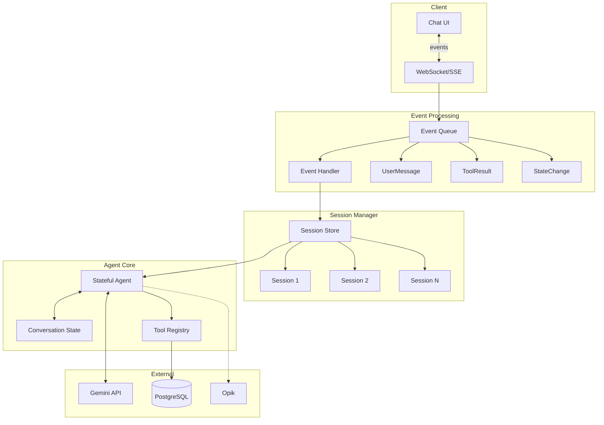

### State Machine

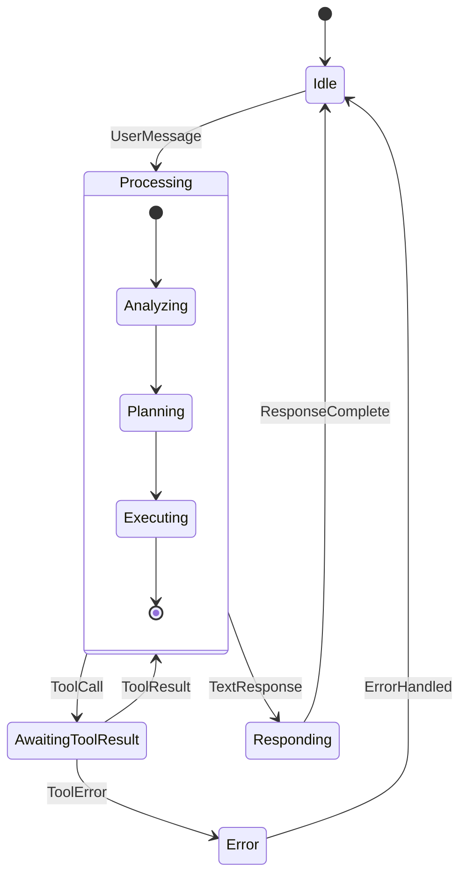

### Implementation

```typescript
// apps/nextjs/src/lib/agent-adk/session.ts
interface AgentSession {
  id: string;
  userId: string;
  state: 'idle' | 'processing' | 'awaiting_tool' | 'responding' | 'error';
  history: Message[];
  context: {
    lastRecipeId?: string;
    lastIngredients?: string[];
    pendingConfirmation?: any;
  };
  createdAt: Date;
  updatedAt: Date;
}

class SessionManager {
  private sessions: Map<string, AgentSession> = new Map();

  create(userId: string): AgentSession {
    const session: AgentSession = {
      id: crypto.randomUUID(),
      userId,
      state: 'idle',
      history: [],
      context: {},
      createdAt: new Date(),
      updatedAt: new Date(),
    };
    this.sessions.set(session.id, session);
    return session;
  }

  get(sessionId: string): AgentSession | undefined {
    return this.sessions.get(sessionId);
  }

  update(sessionId: string, updates: Partial<AgentSession>) {
    const session = this.sessions.get(sessionId);
    if (session) {
      Object.assign(session, updates, { updatedAt: new Date() });
    }
  }
}

export const sessionManager = new SessionManager();
```

```typescript
// apps/nextjs/src/lib/agent-adk/event-agent.ts
import { GoogleGenAI } from '@google/genai';
import { trackGemini } from 'opik-gemini';
import { sessionManager } from './session';
import { toolDeclarations, functionHandlers } from './tools';

type AgentEvent =
  | { type: 'USER_MESSAGE'; payload: { text: string; audio?: string } }
  | { type: 'TOOL_RESULT'; payload: { name: string; result: any } }
  | { type: 'CONFIRM_ACTION'; payload: { confirmed: boolean } }
  | { type: 'CANCEL'; payload: {} };

export class EventDrivenAgent {
  private genAI: GoogleGenAI;
  private trackedGenAI: ReturnType<typeof trackGemini>;

  constructor(private session: AgentSession) {
    this.genAI = new GoogleGenAI({ apiKey: process.env.GOOGLE_GENERATIVE_AI_API_KEY! });
    this.trackedGenAI = trackGemini(this.genAI, {
      generationName: `kitchen-agent-${session.id}`,
      traceMetadata: {
        tags: ['event-driven', 'stateful'],
        sessionId: session.id,
        userId: session.userId,
      },
    });
  }

  async handleEvent(event: AgentEvent): Promise<AgentResponse> {
    sessionManager.update(this.session.id, { state: 'processing' });

    try {
      switch (event.type) {
        case 'USER_MESSAGE':
          return await this.handleUserMessage(event.payload);
        case 'TOOL_RESULT':
          return await this.handleToolResult(event.payload);
        case 'CONFIRM_ACTION':
          return await this.handleConfirmation(event.payload);
        case 'CANCEL':
          return await this.handleCancel();
        default:
          throw new Error(`Unknown event type`);
      }
    } catch (error) {
      sessionManager.update(this.session.id, { state: 'error' });
      throw error;
    }
  }

  private async handleUserMessage(payload: { text: string; audio?: string }) {
    // Add to history
    this.session.history.push({
      role: 'user',
      content: payload.text,
      audio: payload.audio,
    });

    // Build contents for Gemini
    const contents = this.buildContents();

    const response = await this.trackedGenAI.models.generateContent({
      model: 'gemini-2.0-flash',
      systemInstruction: this.getSystemPrompt(),
      contents,
      tools: [{ functionDeclarations: toolDeclarations }],
    });

    const functionCalls = extractFunctionCalls(response);

    if (functionCalls.length > 0) {
      // Check if any require confirmation
      const needsConfirmation = functionCalls.some(fc =>
        ['deleteRecipe', 'markAsCooked'].includes(fc.name)
      );

      if (needsConfirmation) {
        sessionManager.update(this.session.id, {
          state: 'awaiting_tool',
          context: { ...this.session.context, pendingConfirmation: functionCalls },
        });

        return {
          type: 'confirmation_required',
          message: this.buildConfirmationMessage(functionCalls),
          actions: functionCalls,
        };
      }

      // Execute tools
      const results = await this.executeTools(functionCalls);
      return await this.synthesizeResponse(functionCalls, results);
    }

    // Direct response
    sessionManager.update(this.session.id, { state: 'idle' });
    await this.trackedGenAI.flush();

    return {
      type: 'text',
      message: response.text,
    };
  }

  private async handleConfirmation(payload: { confirmed: boolean }) {
    const pending = this.session.context.pendingConfirmation;

    if (!pending) {
      return { type: 'error', message: 'No pending action to confirm' };
    }

    if (payload.confirmed) {
      const results = await this.executeTools(pending);
      sessionManager.update(this.session.id, {
        state: 'idle',
        context: { ...this.session.context, pendingConfirmation: undefined },
      });
      return await this.synthesizeResponse(pending, results);
    } else {
      sessionManager.update(this.session.id, {
        state: 'idle',
        context: { ...this.session.context, pendingConfirmation: undefined },
      });
      return { type: 'text', message: 'Action cancelled.' };
    }
  }

  private async executeTools(functionCalls: FunctionCall[]) {
    return Promise.all(
      functionCalls.map(async (fc) => {
        const handler = functionHandlers[fc.name];
        const result = await handler(fc.args, this.session.userId);

        // Update session context based on tool results
        if (fc.name === 'createRecipe' && result.success) {
          this.session.context.lastRecipeId = result.recipeId;
        }

        return { name: fc.name, result };
      })
    );
  }

  private getSystemPrompt(): string {
    return `You are a helpful kitchen assistant. You help users manage recipes and ingredients.

Current context:
- User has ${this.session.context.lastRecipeId ? 'recently worked on a recipe' : 'no recent recipe context'}
- Session started: ${this.session.createdAt.toISOString()}

Be conversational and helpful. Confirm destructive actions.`;
  }
}
```

```typescript
// apps/nextjs/src/app/api/chat/route.ts
import { sessionManager, EventDrivenAgent } from '@/lib/agent-adk/event-agent';

export async function POST(req: Request) {
  const { sessionId, event } = await req.json();
  const userId = await getUserId(req);

  // Get or create session
  let session = sessionId ? sessionManager.get(sessionId) : null;
  if (!session) {
    session = sessionManager.create(userId);
  }

  const agent = new EventDrivenAgent(session);
  const response = await agent.handleEvent(event);

  return Response.json({
    sessionId: session.id,
    ...response,
  });
}
```

### Pros & Cons

| Pros | Cons |
|------|------|
| Persistent context across turns | Session management complexity |
| Explicit state machine | Memory overhead for sessions |
| Confirmation flows built-in | More complex client integration |
| Event sourcing possible | State synchronization challenges |
| Resumable conversations | Requires session cleanup strategy |

---

## Opik Tracing Integration

### Trace Structure for All Designs

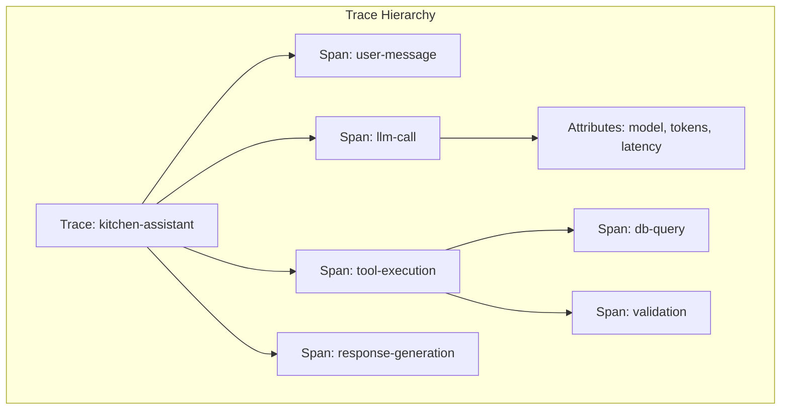

### Integration Patterns

#### 1. Vercel AI SDK with opik-vercel

```typescript
import { streamText } from 'ai';
import { OpikExporter } from 'opik-vercel';

const result = streamText({
  model: google('gemini-2.0-flash'),
  messages,
  tools,
  experimental_telemetry: OpikExporter.getSettings({
    functionId: 'kitchen-assistant',
    metadata: {
      userId,
      sessionId,
      feature: 'agent-chat',
    },
  }),
});
```

#### 2. Google ADK with opik-gemini

```typescript
import { trackGemini } from 'opik-gemini';

const trackedGenAI = trackGemini(genAI, {
  generationName: 'kitchen-assistant',
  traceMetadata: {
    tags: ['agent', 'production'],
    userId,
    sessionId,
    domain: 'kitchen',
  },
});

// After each call
await trackedGenAI.flush();
```

### Exploiting Traces for Improvement

#### 1. Performance Analysis

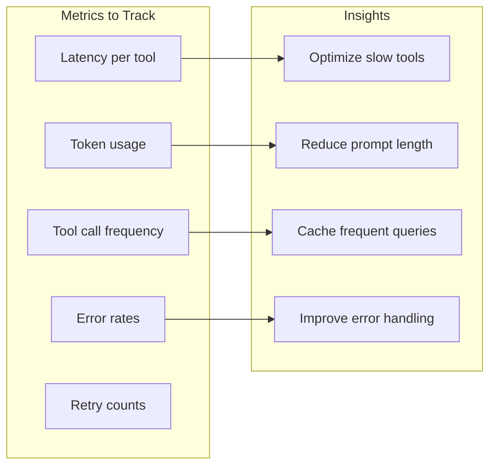

#### 2. Conversation Analysis Dashboard

```typescript
// Query Opik for conversation patterns
const analysisQueries = {
  // Most common intents
  topIntents: `
    SELECT
      metadata.intent,
      COUNT(*) as count
    FROM traces
    WHERE name = 'kitchen-assistant'
    GROUP BY metadata.intent
    ORDER BY count DESC
  `,

  // Tool failure rates
  toolErrors: `
    SELECT
      span.name as tool,
      COUNT(CASE WHEN span.status = 'ERROR' THEN 1 END) as errors,
      COUNT(*) as total
    FROM spans
    WHERE span.type = 'tool-execution'
    GROUP BY span.name
  `,

  // Average conversation length
  conversationDepth: `
    SELECT
      AVG(metadata.turn_count) as avg_turns,
      MAX(metadata.turn_count) as max_turns
    FROM traces
    WHERE name = 'kitchen-assistant'
  `,
};
```

#### 3. Prompt Optimization Loop

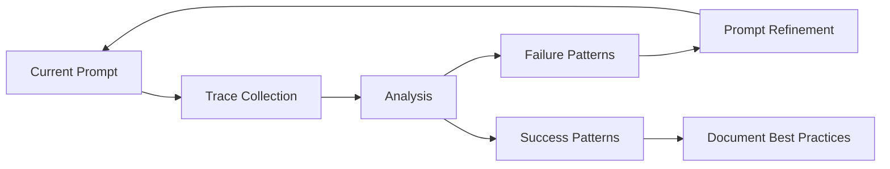

#### 4. A/B Testing with Traces

```typescript
// Tag traces for A/B testing
const trackedGenAI = trackGemini(genAI, {
  generationName: 'kitchen-assistant',
  traceMetadata: {
    experimentId: 'prompt-v2-test',
    variant: Math.random() > 0.5 ? 'control' : 'treatment',
    promptVersion: process.env.PROMPT_VERSION,
  },
});
```

### Custom Trace Attributes for Kitchen Domain

```typescript
const kitchenTraceAttributes = {
  // User context
  'user.recipe_count': await getRecipeCount(userId),
  'user.inventory_size': await getInventorySize(userId),
  'user.last_cooked': await getLastCookedDate(userId),

  // Request context
  'request.has_audio': !!audioInput,
  'request.message_length': message.length,
  'request.intent': classifiedIntent,

  // Tool context
  'tool.recipes_modified': modifiedRecipeIds,
  'tool.ingredients_updated': updatedIngredientCount,
  'tool.validation_errors': validationErrors,

  // Response context
  'response.tool_calls': toolCallCount,
  'response.tokens_used': tokenCount,
  'response.latency_ms': latency,
};
```

---

## Prompt Engineering Guidelines

### System Prompt Structure

```typescript
const SYSTEM_PROMPT = `
# Role
You are HomeCuistot, a friendly kitchen assistant that helps users manage their recipes and ingredients.

# Capabilities
You can:
- Create, update, and delete recipes
- Manage ingredient inventory (add, remove, update quantities)
- Track pantry staples
- Log cooking events and suggest what to cook
- Search the ingredient database

# Constraints
- Only modify the current user's data
- Validate ingredient names against the database before adding
- Confirm destructive actions (delete recipe, clear inventory)
- Keep responses concise but friendly
- If unsure, ask for clarification

# Quantity Levels
- 0: Out of stock / Empty
- 1: Running low
- 2: Some available
- 3: Fully stocked

# Ingredient Types
- anchor: Core ingredient (required)
- optional: Can be omitted
- assumed: Expected to be available (salt, pepper, oil)

# Response Format
- Be conversational but efficient
- Confirm successful actions briefly
- List items in bullet points when showing multiple
- Use the user's language (match their tone)
`;
```

### Tool Description Best Practices

```typescript
// Good: Specific, actionable, with constraints
const createRecipeTool = {
  name: 'createRecipe',
  description: `Create a new recipe for the user.
    The recipe will be saved to their personal cookbook.
    Ingredients should be common names (e.g., "tomato" not "roma tomato").
    Limit to 1-20 ingredients per recipe.`,
  parameters: {
    // ...
  },
};

// Bad: Vague, no guidance
const badTool = {
  name: 'createRecipe',
  description: 'Creates a recipe',
  parameters: {
    // ...
  },
};
```

### Few-Shot Examples in Prompts

```typescript
const EXAMPLES = `
# Examples

User: "I just bought tomatoes, onions, and garlic"
Assistant: I'll add those to your inventory at full stock level.
[Calls: addToInventory for each ingredient with quantityLevel=3]
Done! I've added tomatoes, onions, and garlic to your inventory (all fully stocked).

User: "I'm almost out of milk"
Assistant: I'll update your milk inventory to "running low".
[Calls: updateInventory with ingredientName="milk", quantityLevel=1]
Updated! Milk is now marked as running low.

User: "What can I make for dinner?"
Assistant: Let me check what recipes match your current inventory.
[Calls: getCookableRecipes with minimumMatchPercentage=70]
Based on what you have, you can make:
• Pasta Carbonara (95% match) - missing: parmesan
• Tomato Soup (100% match)
• Garlic Bread (85% match) - running low on butter

User: "Delete my pasta recipe"
Assistant: Are you sure you want to delete your Pasta Carbonara recipe? This cannot be undone.
[Waits for confirmation before calling deleteRecipe]
`;
```

---

## Guardrails & Safety

### Input Validation

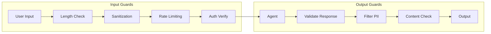

### Implementation

```typescript
// apps/nextjs/src/lib/agent/guardrails.ts

// Input guardrails
export const inputGuards = {
  maxMessageLength: 2000,
  maxAudioDuration: 60, // seconds
  rateLimitPerMinute: 30,

  validate(input: AgentInput): ValidationResult {
    const errors: string[] = [];

    if (input.text && input.text.length > this.maxMessageLength) {
      errors.push(`Message too long (max ${this.maxMessageLength} chars)`);
    }

    if (input.audio && input.audioDuration > this.maxAudioDuration) {
      errors.push(`Audio too long (max ${this.maxAudioDuration} seconds)`);
    }

    // Check for injection attempts
    if (this.containsInjection(input.text)) {
      errors.push('Invalid input detected');
    }

    return { valid: errors.length === 0, errors };
  },

  containsInjection(text: string): boolean {
    const patterns = [
      /ignore previous instructions/i,
      /system prompt/i,
      /you are now/i,
      /forget everything/i,
    ];
    return patterns.some(p => p.test(text));
  },
};

// Tool execution guardrails
export const toolGuards = {
  // Destructive actions require confirmation
  requiresConfirmation: ['deleteRecipe', 'clearInventory', 'markAsCooked'],

  // Rate limits per tool
  rateLimits: {
    createRecipe: 10, // per hour
    deleteRecipe: 5,
    markAsCooked: 20,
  },

  // Max items per operation
  maxBatchSize: {
    addToInventory: 50,
    updateInventory: 50,
  },

  async checkPermission(tool: string, userId: string): Promise<boolean> {
    // Check user's rate limit for this tool
    const count = await getToolUsageCount(userId, tool, 'hour');
    return count < (this.rateLimits[tool] || 100);
  },
};

// Output guardrails
export const outputGuards = {
  // Never expose these in responses
  sensitivePatterns: [
    /user_?id/i,
    /api_?key/i,
    /password/i,
    /token/i,
  ],

  sanitize(response: string): string {
    let sanitized = response;

    // Remove any accidentally exposed IDs
    sanitized = sanitized.replace(/[a-f0-9]{8}-[a-f0-9]{4}-[a-f0-9]{4}-[a-f0-9]{4}-[a-f0-9]{12}/gi, '[ID]');

    return sanitized;
  },
};
```

### Error Handling Strategy

```typescript
// apps/nextjs/src/lib/agent/error-handler.ts

export class AgentError extends Error {
  constructor(
    message: string,
    public code: string,
    public recoverable: boolean = true,
    public userMessage?: string
  ) {
    super(message);
  }
}

export const errorMessages = {
  INGREDIENT_NOT_FOUND: "I couldn't find that ingredient in our database. Could you try a different name or check the spelling?",
  RECIPE_NOT_FOUND: "I couldn't find that recipe. Would you like to see your available recipes?",
  RATE_LIMITED: "You're doing a lot right now! Please wait a moment before trying again.",
  TOOL_FAILED: "Something went wrong while performing that action. Let me try again.",
  INVALID_INPUT: "I didn't quite understand that. Could you rephrase?",
};

export async function handleAgentError(error: Error, context: AgentContext): Promise<AgentResponse> {
  // Log error to Opik
  await logErrorToOpik(error, context);

  if (error instanceof AgentError) {
    return {
      type: 'error',
      message: error.userMessage || errorMessages[error.code] || 'Something went wrong.',
      recoverable: error.recoverable,
    };
  }

  // Generic error
  return {
    type: 'error',
    message: "I encountered an unexpected issue. Please try again.",
    recoverable: true,
  };
}
```

---

## Recommendation & Trade-offs

### Comparison Matrix

| Aspect | Design 1 | Design 2 | Design 3 | Design 4 | Design 5 | Design 6 |
|--------|----------|----------|----------|----------|----------|----------|
| **SDK** | Vercel | Vercel | Vercel | ADK-JS | ADK-JS | ADK-JS |
| **Complexity** | Low | Medium | High | Low | High | High |
| **Latency** | Low | Medium | Low | Low | High | Medium |
| **Scalability** | Medium | High | Medium | Medium | High | High |
| **Maintainability** | High | High | Medium | High | Medium | Medium |
| **UX Richness** | Medium | Medium | High | Medium | Medium | High |
| **Opik Integration** | Native | Native | Native | Manual | Manual | Manual |
| **Voice Support** | Via transcription | Via transcription | Via transcription | Native | Native | Native |

### Recommended Approach

**For Homecuistot, I recommend starting with Design 1 (Vercel AI SDK - Single Agent) with a migration path to Design 3 (Streaming UI) as the product matures.**

#### Rationale:

1. **Existing Infrastructure**: Your codebase already uses `@ai-sdk/google` and has Opik integrated via `opik-vercel`
2. **Simplicity**: Single agent is easier to develop, test, and iterate on
3. **Migration Path**: Tools can be directly reused when evolving to UI streaming
4. **Voice Support**: Already handled by your existing transcription → text pipeline
5. **Lower Latency**: No routing overhead
6. **Native Streaming**: Vercel AI SDK handles streaming well with Next.js

#### Migration Path:

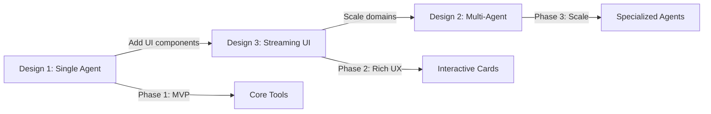

### Implementation Priority

1. **Week 1-2**: Implement Design 1 with core tools (CRUD for recipes, inventory)
2. **Week 3-4**: Add cooking actions and query tools
3. **Week 5-6**: Migrate to Design 3 for rich UI responses
4. **Future**: Consider Design 2 if domain complexity increases

---

## Next Steps

1. **Review this document** and provide feedback on design preferences
2. **Approve the recommended approach** or select an alternative
3. **Begin implementation** following the speckit phase protocol
4. **Set up Opik dashboards** for monitoring agent performance

---

*Document generated for Homecuistot AI Agent Design*
*Version: 1.0*
*Date: 2025*
